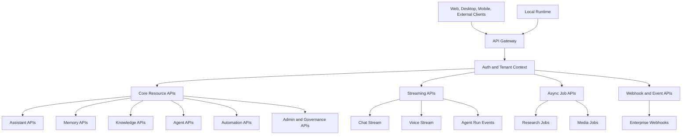
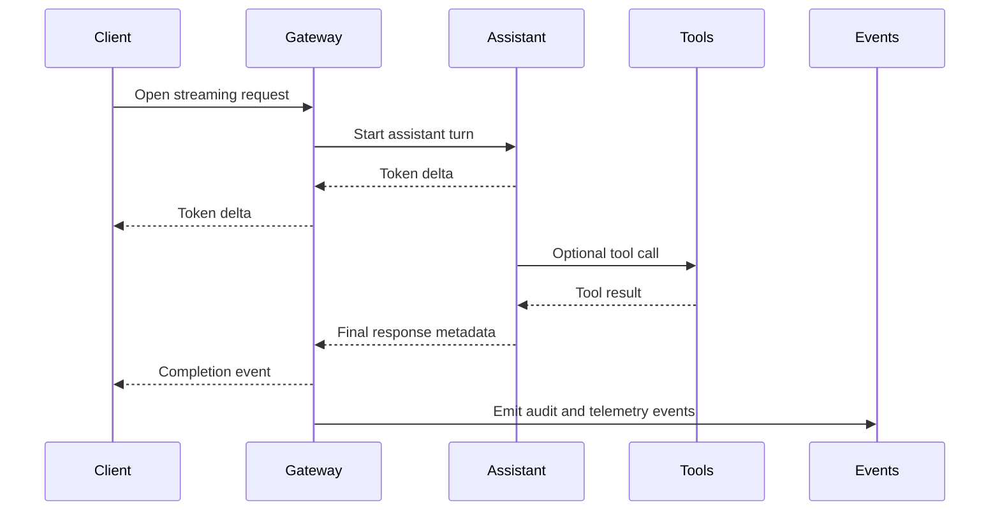
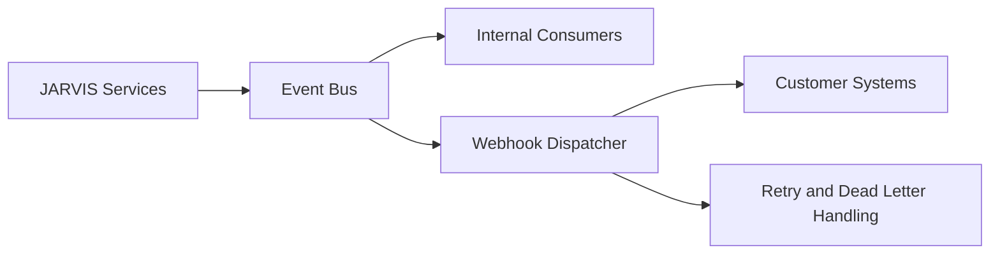

# JARVIS API Design

## Planning Summary

The JARVIS API surface should expose the platform as a secure, enterprise-grade AI Operating System. APIs must support conversational assistant experiences, streaming voice and chat, long-term memory, knowledge retrieval, agent orchestration, local runtime coordination, browser and computer automation, intelligence pipelines, and governance.

This document defines API principles, resource groups, interaction patterns, and risks without specifying implementation code.

## API Design Goals

- Provide stable interfaces for first-party clients, local runtimes, enterprise integrations, and future third-party extensions.
- Support synchronous requests, streaming interactions, asynchronous jobs, webhooks, and event-driven workflows.
- Enforce tenant, workspace, role, policy, and tool permissions consistently.
- Make agent, memory, knowledge, and automation operations auditable.
- Keep versioning and compatibility predictable for enterprise customers.

## API Principles

1. **Policy-first access**
   Every API request must be evaluated against identity, tenant, workspace, role, and policy context.

2. **Streaming where experience requires it**
   Chat, voice, agent progress, and automation sessions should support streaming updates.

3. **Asynchronous by default for long work**
   Research, video processing, knowledge ingestion, and multi-agent tasks should return job or task handles.

4. **Explicit resource boundaries**
   APIs should scope resources by tenant and workspace to avoid ambiguous data access.

5. **Auditable operations**
   Sensitive actions, policy changes, tool calls, memory updates, and automation events must emit audit records.

6. **Provider neutrality**
   APIs should avoid leaking model, vector store, or infrastructure provider details unless needed for observability.

## API Surface Overview

## Authentication And Authorization

### Goals

- Authenticate users, local runtimes, service accounts, and integrations.
- Authorize every request using tenant, workspace, role, policy, and resource context.
- Support enterprise identity and future marketplace integrations.

### Responsibilities

- Validate tokens and session state.
- Resolve tenant and workspace context.
- Enforce RBAC and policy controls.
- Support scoped API keys or service account credentials.
- Emit audit events for sensitive access and administrative changes.

### Expected Capabilities

- Single sign-on support.
- OAuth-style delegated authorization for integrations.
- Service accounts for automation and server-to-server calls.
- Device-bound credentials for local runtimes.
- Short-lived access tokens and refresh flows.
- Permission scopes for agents, tools, memory, knowledge, and admin APIs.

### Risks

- Overly broad tokens can expose sensitive tools or data.
- Local runtime authentication must resist device impersonation.
- Service accounts require lifecycle management and rotation.

## Versioning And Compatibility

### Strategy

- Use explicit API versioning for public APIs.
- Maintain backward compatibility within a major version.
- Introduce new resource fields as additive changes.
- Deprecate behavior with clear migration timelines.
- Keep internal service contracts separately versioned from external APIs.

### Risks

- Rapid AI feature changes can pressure API stability.
- Streaming and event contracts are harder to evolve than simple resource APIs.
- Enterprise customers may require long deprecation windows.

## Core Resource APIs

### Tenant And Workspace APIs

Responsibilities:

- Manage tenants, workspaces, memberships, roles, and service accounts.
- Retrieve workspace configuration and policy assignments.
- Support admin operations and enterprise onboarding.

Representative resources:

- Tenants.
- Workspaces.
- Users.
- Memberships.
- Roles.
- Service accounts.
- Policy assignments.

Future expansion:

- Organization units.
- Group sync.
- Regional data residency settings.
- Customer-managed encryption key configuration.

Risks:

- Incorrect workspace scoping can cause data exposure.
- Admin APIs require strong audit and permission controls.

### Conversation And Assistant APIs

Responsibilities:

- Create and manage conversations.
- Send messages and stream assistant responses.
- Attach files and reference workspace context.
- Capture feedback and corrections.
- Link responses to citations, memories, tasks, and agent runs.

Representative operations:

- Create conversation.
- List conversations.
- Send message.
- Stream assistant response.
- Retrieve message history.
- Submit user feedback.

Future expansion:

- Multimodal message input.
- Conversation summarization.
- Assistant profiles and modes.
- Shared conversation templates.

Risks:

- Chat context can include sensitive data.
- Streaming failure handling must be clear.
- Model outputs require safety and quality checks.

## Streaming APIs

Streaming is required for experiences where incremental feedback matters.

Streaming channels should support:

- Chat response deltas.
- Voice transcription and synthesis events.
- Agent run progress.
- Tool execution status.
- Approval requests.
- Automation session updates.

Risks:

- Network interruptions can leave client and server state inconsistent.
- Streaming events must avoid leaking internal chain-of-thought or sensitive tool data.
- Retry semantics must avoid duplicate actions.

## Memory APIs

### Goals

- Allow users and authorized agents to create, retrieve, update, approve, reject, and delete memories.
- Support transparent memory governance.

### Responsibilities

- Store explicit and suggested memories.
- Retrieve relevant memories for assistant and agent context.
- Expose memory provenance, scope, confidence, and sensitivity.
- Enforce retention and deletion.

Representative resources:

- Memories.
- Memory suggestions.
- Memory reviews.
- Memory scopes.

Future expansion:

- Memory conflict resolution.
- Bulk memory export.
- Memory review workflows.
- Enterprise memory policy APIs.

Risks:

- Memory APIs can expose sensitive personal data.
- Deletion must address embeddings and derived indexes.
- Agents should not freely create high-sensitivity memories without approval.

## Knowledge Base APIs

### Goals

- Manage knowledge collections, sources, ingestion jobs, chunks, retrieval, and citations.
- Support RAG across documents, web pages, media transcripts, and enterprise connectors.

### Responsibilities

- Create and update knowledge collections.
- Upload or register sources.
- Track ingestion status.
- Retrieve relevant chunks.
- Provide source citations and freshness metadata.
- Enforce source permissions.

Representative resources:

- Knowledge collections.
- Knowledge sources.
- Ingestion jobs.
- Chunks.
- Retrieval queries.
- Citations.

Future expansion:

- Connector sync APIs.
- Knowledge graph APIs.
- Federated search APIs.
- Evaluation APIs for groundedness and retrieval quality.

Risks:

- Retrieval endpoints can leak unauthorized snippets if permission filtering fails.
- Ingestion jobs can process malicious or malformed content.
- Large documents and media transcripts need async handling.

## Agent APIs

### Goals

- Create, run, monitor, pause, cancel, and evaluate agents.
- Support single-agent and multi-agent workflows.

### Responsibilities

- Expose agent definitions and capabilities.
- Start tasks with autonomy, budget, tool, and data constraints.
- Stream run progress.
- Record plans, steps, tool calls, approvals, outputs, and evaluations.

Representative resources:

- Agents.
- Agent templates.
- Tasks.
- Agent runs.
- Agent steps.
- Tool executions.
- Approval requests.
- Evaluations.

Future expansion:

- Agent marketplace.
- Agent simulation APIs.
- Multi-agent mission APIs.
- Policy packs and capability bundles.

Risks:

- Agent APIs can become overly powerful if policy checks are weak.
- Long-running run state must survive retries and worker failures.
- Tool execution data can contain sensitive content.

## Automation APIs

### Goals

- Coordinate local runtime, browser automation, and computer control sessions.
- Provide safe, policy-gated automation.

### Responsibilities

- Register and manage devices.
- Establish local runtime sessions.
- Request automation permissions.
- Start, monitor, pause, cancel, and audit automation sessions.
- Send approval prompts for sensitive actions.

Representative resources:

- Devices.
- Local runtime sessions.
- Browser sessions.
- Computer control sessions.
- Automation actions.
- Session artifacts.
- Automation policies.

Future expansion:

- Reusable workflow APIs.
- App-specific automation adapters.
- Enterprise device group policies.
- Automation simulation and dry-run APIs.

Risks:

- Automation APIs can trigger real-world side effects.
- Idempotency and replay must be carefully designed.
- Session artifacts require strict data retention controls.

## Research, News, And Video Intelligence APIs

### Research APIs

Responsibilities:

- Create research projects.
- Start research tasks.
- Track sources, evidence, findings, and reports.
- Export research outputs with citations.

Future expansion:

- Collaborative research workspaces.
- Domain-specific report templates.
- Recurring research monitors.

Risks:

- External source data requires licensing review.
- Research outputs need uncertainty and citation metadata.

### News Intelligence APIs

Responsibilities:

- Manage watchlists.
- Configure topics, entities, and alert thresholds.
- Retrieve briefs, alerts, clusters, and source summaries.
- Capture feedback on alert relevance.

Future expansion:

- Executive brief APIs.
- Competitive intelligence feeds.
- Regulatory and geopolitical monitoring.

Risks:

- Alert fatigue can reduce trust.
- Source bias and licensing must be managed.

### Video Intelligence APIs

Responsibilities:

- Upload or register media assets.
- Start processing jobs.
- Retrieve transcripts, scenes, summaries, insights, and timestamp citations.
- Search within media timelines.

Future expansion:

- Multimodal event APIs.
- Meeting intelligence APIs.
- Visual evidence extraction APIs.

Risks:

- Media uploads require large-file and resumable processing.
- Video data is privacy-sensitive and expensive to process.

## Admin And Governance APIs

### Goals

- Give enterprise administrators control over users, policies, data, agents, tools, audit logs, and compliance exports.

### Responsibilities

- Manage policy definitions and assignments.
- Configure memory, data retention, tool access, and autonomy levels.
- Review audit logs and security events.
- Export compliance records.
- Configure tenant-level limits, budgets, and integrations.

Representative resources:

- Policies.
- Policy assignments.
- Audit events.
- Compliance exports.
- Usage reports.
- Cost budgets.
- Tool permissions.
- Data retention rules.

Future expansion:

- Policy simulation.
- Risk scoring.
- Anomaly detection.
- Legal hold.
- Compliance framework mapping.

Risks:

- Governance APIs are high-value targets.
- Misconfigured policies can either block useful work or permit unsafe work.
- Audit export formats may vary by customer and compliance requirement.

## Event And Webhook APIs

### Goals

- Notify clients and integrations about asynchronous events.
- Support reliable automation and enterprise workflows.

Event categories:

- Conversation events.
- Memory events.
- Knowledge ingestion events.
- Agent run events.
- Tool execution events.
- Approval events.
- Automation session events.
- Research and news events.
- Video processing events.
- Audit and policy events.

Webhook responsibilities:

- Sign outbound events.
- Retry transient failures.
- Support dead-letter queues.
- Allow event filtering by tenant and workspace.
- Avoid sending sensitive payloads unless configured and authorized.

Risks:

- Duplicate delivery requires idempotent consumers.
- Webhooks can leak metadata if payloads are too broad.
- Event schema evolution needs versioning.

## Integration Strategy

JARVIS should support integrations through:

- Public REST APIs for resource management.
- Streaming APIs for real-time experiences.
- Webhooks for asynchronous notifications.
- Connector framework for enterprise applications.
- Tool registry for agent-usable capabilities.
- Service accounts for secure server-to-server automation.
- Marketplace governance for future third-party extensions.

## API Observability

Every API group should expose or emit:

- Request latency.
- Error rate.
- Rate-limit events.
- Authentication and authorization failures.
- Tenant and workspace usage.
- Model and agent cost attribution where relevant.
- Audit events for sensitive operations.
- Correlation IDs for tracing across services.

## API Design Risks

| Risk | Impact | Mitigation |
| --- | --- | --- |
| Overly broad API permissions | Data exposure or unsafe automation | Scoped tokens, policy checks, least privilege, audit |
| Inconsistent resource scoping | Cross-workspace data leakage | Tenant and workspace context on all resource APIs |
| Unstable agent contracts | Difficult client and integration development | Versioned run events, additive schema changes, compatibility policy |
| Duplicate async execution | Repeated external actions | Idempotency keys, run state, action confirmation |
| Sensitive streaming payloads | Privacy and security issues | Event filtering, redaction, strict client authorization |
| Weak webhook reliability | Missed enterprise workflows | Signed events, retries, dead-letter handling, replay APIs |
