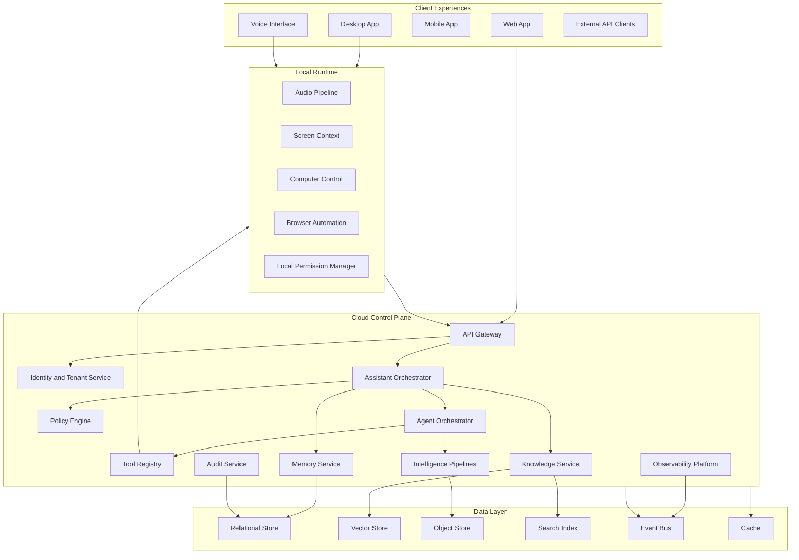
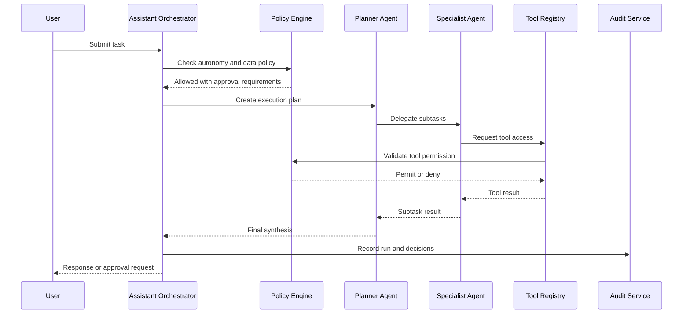

# JARVIS Architecture

## Planning Summary

JARVIS is a hybrid, enterprise-grade AI Operating System. The architecture combines local device runtimes for voice, computer control, browser automation, and local context with cloud services for identity, governance, memory, knowledge retrieval, orchestration, intelligence pipelines, observability, and agent execution.

The system is designed for modular growth. Each capability should be independently scalable, observable, governable, and replaceable.

## Architectural Goals

- Support a unified assistant experience across chat, voice, browser, desktop, and enterprise workflows.
- Separate user experience, orchestration, memory, knowledge, tool execution, and governance into clear platform layers.
- Enable safe, auditable, policy-controlled automation.
- Scale long-running agents, retrieval workloads, media processing, and event-driven intelligence pipelines.
- Maintain strong tenant isolation, encryption, RBAC, and compliance readiness.
- Support future multi-agent systems without requiring a core platform rewrite.

## High-Level Architecture

## Platform Layers

### Experience Layer

The experience layer provides user access to JARVIS.

Responsibilities:

- Chat, voice, command palette, notifications, and dashboards.
- Workspace and admin interfaces.
- Approval prompts and automation controls.
- Streaming responses and task progress.
- User feedback and correction flows.

Future expansion:

- Mobile assistant.
- Embedded enterprise widgets.
- Augmented reality or wearable interfaces.
- Native OS command surfaces.

Risks:

- Fragmented experiences can make JARVIS feel inconsistent.
- Poor approval UX can make safe automation feel slow or annoying.

### Local Runtime Layer

The local runtime enables trusted device interaction.

Responsibilities:

- Voice capture and playback.
- Screen and application context capture with permission.
- Browser automation.
- Computer control.
- Secure session bridge to cloud services.
- Local permission enforcement.

Future expansion:

- Offline command support.
- Local model inference for sensitive tasks.
- Device-to-device continuity.
- Enterprise-managed runtime policies.

Risks:

- Local permissions differ across operating systems.
- Device-level automation has high safety requirements.
- Local runtime compromise could expose sensitive context.

### Cloud Control Plane

The cloud control plane coordinates intelligence, governance, APIs, and persistence.

Responsibilities:

- Identity, tenants, workspaces, and roles.
- Assistant and agent orchestration.
- Policy enforcement.
- Memory and knowledge retrieval.
- Tool registry and execution routing.
- Intelligence pipeline management.
- Audit, observability, and cost tracking.

Future expansion:

- Private cloud or dedicated tenant deployments.
- Regional data residency.
- Enterprise connector marketplace.
- Advanced policy simulation and enforcement.

Risks:

- Weak service boundaries can create platform coupling.
- Control plane outages can degrade user trust.
- Cross-tenant isolation failures are severe.

### Intelligence Layer

The intelligence layer contains models, prompts, tools, agents, evaluators, and workflows.

Responsibilities:

- Model routing.
- Prompt and context construction.
- Agent planning and execution.
- Retrieval and synthesis.
- Evaluation and safety checks.
- Cost and latency optimization.

Future expansion:

- Domain-specialized models.
- Model ensembles.
- Agent simulations.
- Continuous quality evaluation.

Risks:

- Model provider changes can affect output quality.
- Poor prompt or tool design can create unreliable behavior.
- Agentic workloads can become expensive.

### Data Layer

The data layer stores operational, knowledge, memory, media, event, and audit data.

Responsibilities:

- Transactional records.
- Vector embeddings.
- Search indexes.
- Object and media storage.
- Event streams.
- Caches and derived views.

Future expansion:

- Knowledge graph store.
- Data warehouse for analytics.
- Federated search.
- Customer-managed encryption keys.

Risks:

- Inconsistent data classification can weaken governance.
- Large memory and media workloads require lifecycle management.
- Index drift can reduce retrieval quality.

## Core Services

| Service | Responsibilities |
| --- | --- |
| API Gateway | Request routing, authentication enforcement, rate limits, streaming connections |
| Identity and Tenant Service | Users, tenants, workspaces, roles, memberships, service accounts |
| Policy Engine | Tool permissions, data access rules, autonomy levels, approval requirements |
| Assistant Orchestrator | Chat sessions, context assembly, model routing, response streaming |
| Agent Orchestrator | Task planning, agent runs, delegation, retries, budgets, run state |
| Memory Service | User and workspace memories, provenance, retention, deletion |
| Knowledge Service | Ingestion, parsing, chunking, embeddings, retrieval, citations |
| Tool Registry | Tool metadata, connectors, local runtime capabilities, permission requirements |
| Automation Service | Browser and computer control session coordination |
| Intelligence Pipelines | Research, news, video, media, and monitoring jobs |
| Audit Service | Immutable audit records for actions, policies, data access, and agent runs |
| Observability Platform | Logs, metrics, traces, evaluations, costs, model quality signals |

## Agent Orchestration

## Security Architecture

### Security Goals

- Enforce least privilege for users, agents, tools, and services.
- Maintain tenant and workspace isolation.
- Protect sensitive data in transit, at rest, and during model/tool usage.
- Provide auditable records for enterprise review.
- Prevent unapproved automation and unauthorized memory or knowledge access.

### Required Controls

- Single sign-on and enterprise identity integration.
- Multi-factor authentication support.
- Role-based access control.
- Attribute and policy-based access controls for tools and data.
- Encryption in transit and at rest.
- Secrets management and credential vault integration.
- Tenant-aware rate limits and quotas.
- Audit logs for data access, agent runs, tool execution, policy changes, and admin actions.
- Approval gates for high-risk actions.
- Data retention and deletion enforcement.

## Scalability Strategy

| Workload | Scaling Approach |
| --- | --- |
| Chat and voice sessions | Horizontal API and orchestration services, streaming infrastructure, cache hot context |
| Agent runs | Queue-based workers, budgets, retries, idempotent task steps, run state persistence |
| RAG retrieval | Sharded vector indexes, hybrid search, metadata filters, embedding cache |
| Knowledge ingestion | Async pipelines, document processing queues, backpressure controls |
| Video intelligence | Batch media workers, object storage lifecycle, resumable processing jobs |
| News monitoring | Scheduled ingestion, source deduplication, topic clustering, alert ranking |
| Browser and computer automation | Local execution with cloud coordination, session limits, domain policies |
| Audit and observability | Append-only event streams, partitioned storage, retention tiers |

## Deployment Strategy

```mermaid
flowchart LR
    subgraph Device["User Device"]
        LocalRuntime["JARVIS Local Runtime"]
        BrowserExt["Browser Extension"]
        DesktopApp["Desktop App"]
    end

    subgraph Edge["Edge Layer"]
        Gateway["API Gateway"]
        WSS["Streaming Gateway"]
    end

    subgraph Services["Cloud Services"]
        Control["Control Plane Services"]
        Agents["Agent Workers"]
        Pipelines["Intelligence Pipelines"]
    end

    subgraph Storage["Managed Storage"]
        DB["Relational Database"]
        VDB["Vector Database"]
        OBJ["Object Storage"]
        BUS["Event Bus"]
    end

    Device --> Edge
    Edge --> Services
    Services --> Storage
```

Deployment should support:

- Multi-region edge routing.
- Region-aware data storage.
- Tenant-level isolation controls.
- Blue-green or canary deployments.
- Worker autoscaling.
- Disaster recovery and backup policies.
- Private or dedicated deployments for regulated enterprises.

## Observability And Operations

JARVIS must provide observability across application, model, agent, tool, and data layers.

Required signals:

- Request latency and error rates.
- Model latency, cost, token usage, and quality metrics.
- Agent run status, retries, failures, and tool usage.
- Retrieval quality, citation coverage, and source freshness.
- Memory creation, retrieval, correction, and deletion.
- Automation session outcomes.
- Policy denies and approval flows.
- Tenant-level usage, quotas, and budgets.

## Future Expansion Strategy

The architecture should evolve through additive modules:

- Add new agents through the agent registry.
- Add new tools through the tool registry and policy engine.
- Add new knowledge sources through ingestion connectors.
- Add new client experiences through the API and streaming gateways.
- Add new deployment models through infrastructure abstraction and tenant policies.
- Add new data stores only when existing stores cannot meet access, scale, or compliance requirements.

## Architectural Risks

| Risk | Impact | Mitigation |
| --- | --- | --- |
| Monolithic orchestration | Difficult scaling and slow feature delivery | Use clear service contracts and event-driven boundaries |
| Unsafe local automation | User harm or enterprise rejection | Local permissions, approval gates, session interruption, audit logs |
| Data leakage across tenants | Critical security incident | Tenant-aware schemas, policy enforcement, testing, encryption, audit |
| Agent unpredictability | Poor trust and reliability | Supervisors, evaluations, budgets, retries, approvals, run replay |
| High model and media costs | Unsustainable operating model | Model routing, caching, quotas, batch processing, cost dashboards |
| Poor observability | Slow incident response and quality regression | End-to-end tracing, structured events, evaluation metrics |
| Vendor lock-in | Limited flexibility | Provider-neutral interfaces for models, storage, search, and speech |
