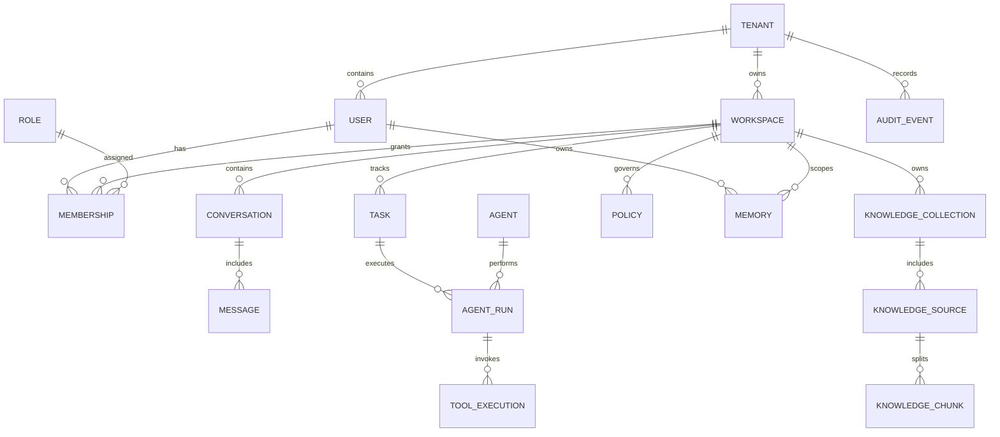
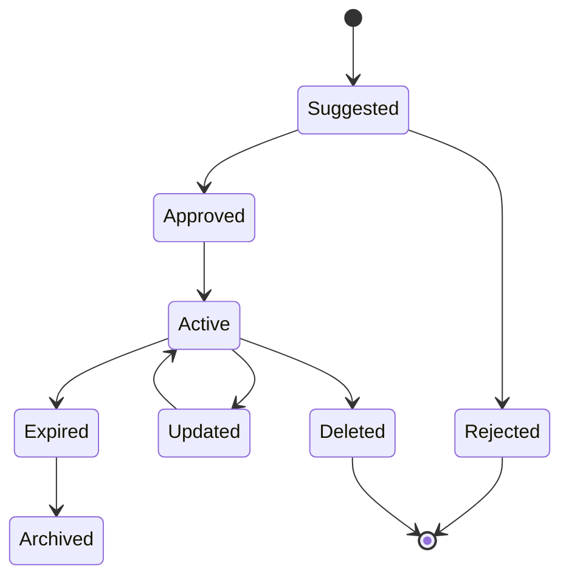
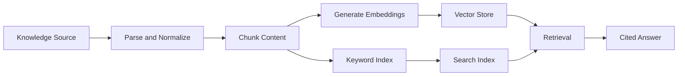

# JARVIS Database Design

## Planning Summary

JARVIS requires a multi-store data architecture. Transactional entities such as tenants, users, workspaces, roles, conversations, tasks, agent runs, policies, and audit records belong in a relational store. Embeddings and retrieval indexes belong in a vector store and search index. Documents, media, transcripts, screenshots, and derived artifacts belong in object storage. Event streams connect asynchronous services and preserve operational history.

This document describes the logical data domains and storage responsibilities without defining implementation code or physical database migrations.

## Data Design Goals

- Support multi-tenant enterprise isolation.
- Preserve auditability for users, agents, tools, policies, and data access.
- Enable long-term memory with consent, provenance, retention, and deletion.
- Support knowledge base retrieval with citations and access controls.
- Track long-running agent, research, news, video, browser, and computer-control workflows.
- Keep the design extensible for future agents, tools, connectors, and deployment models.

## Storage Strategy

| Store | Primary Responsibilities |
| --- | --- |
| Relational database | Tenants, users, workspaces, memberships, conversations, messages, tasks, agent runs, policies, audit records |
| Vector store | Embeddings for memories, document chunks, transcripts, media-derived text, and semantic retrieval |
| Search index | Keyword and hybrid search over knowledge, memories, conversations, and source metadata |
| Object storage | Original files, documents, screenshots, audio, video, transcripts, generated reports, extracted frames |
| Event bus | Agent events, ingestion events, audit events, notifications, pipeline status, automation session events |
| Cache | Session context, rate limits, short-lived retrieval results, model routing decisions, streaming state |
| Analytics warehouse | Product analytics, quality metrics, cost analysis, operational dashboards |

## Core Entity Relationship Overview

## Identity And Tenancy Domain

### Goals

- Represent organizations, users, workspaces, roles, and memberships.
- Enforce tenant and workspace isolation.
- Support enterprise identity and service accounts.

### Responsibilities

- Store tenant configuration and data residency preferences.
- Store user profiles and identity provider mappings.
- Store workspace membership and roles.
- Store service accounts for automation and integrations.
- Support policy and audit lookups.

### Logical Entities

| Entity | Purpose |
| --- | --- |
| Tenant | Enterprise or organization boundary |
| User | Human account within one or more tenants |
| Workspace | Collaboration and data boundary inside a tenant |
| Membership | User-to-workspace relationship |
| Role | Permission bundle assigned to users or service accounts |
| Service Account | Non-human identity for integrations and automated workflows |

### Future Expansion Strategy

- Add organization units, groups, and external identity provider claims.
- Add delegated administration by workspace or department.
- Add customer-managed encryption key references per tenant.

### Risks

- Incorrect tenant scoping can expose data.
- Overly rigid role models can block enterprise adoption.
- Identity provider drift can create orphaned access.

## Conversation And Assistant Domain

### Goals

- Persist chat sessions, messages, attachments, model metadata, and assistant outputs.
- Support replay, summarization, memory extraction, and audit.

### Responsibilities

- Store conversation metadata.
- Store user, assistant, tool, and system messages.
- Track model provider, model name, latency, cost, and response metadata.
- Link messages to knowledge citations, memories, files, tasks, and agent runs.

### Logical Entities

| Entity | Purpose |
| --- | --- |
| Conversation | Thread of interaction within a workspace |
| Message | Individual chat, tool, system, or agent message |
| Attachment | Uploaded or referenced file associated with a message |
| Citation | Source reference used in assistant response |
| Feedback | User rating, correction, or qualitative feedback |

### Future Expansion Strategy

- Add conversation summarization checkpoints.
- Add semantic search over conversation history.
- Add conversation-to-task and conversation-to-memory extraction.

### Risks

- Storing too much raw context increases privacy and cost risk.
- Deleting conversations must cascade or detach related derived artifacts correctly.
- Model metadata must avoid exposing provider-sensitive internals.

## Long-Term Memory Domain

### Goals

- Store durable user and workspace memories with provenance, consent, confidence, and retention.
- Support memory retrieval, inspection, correction, and deletion.

### Responsibilities

- Distinguish personal, workspace, and tenant-level memory.
- Track who or what created the memory.
- Track source conversation, document, task, or agent run.
- Store memory status, confidence, sensitivity, and expiration.
- Link memory records to vector embeddings and search indexes.

### Logical Entities

| Entity | Purpose |
| --- | --- |
| Memory | Durable fact, preference, decision, or context item |
| Memory Scope | User, workspace, tenant, or project boundary |
| Memory Provenance | Source and reason for memory creation |
| Memory Embedding | Vector representation for semantic retrieval |
| Memory Review | User or admin correction, approval, or deletion record |

### Memory Lifecycle

### Future Expansion Strategy

- Add memory conflict detection.
- Add periodic memory review workflows.
- Add memory portability exports.
- Add tenant policy controls for automatic memory creation.

### Risks

- Memory retrieval may expose stale or inappropriate context.
- Automatic memory creation requires careful user trust design.
- Deletion must remove or disable derived embeddings and search entries.

## Knowledge Base Domain

### Goals

- Store structured metadata for documents, web pages, internal knowledge, transcripts, and indexed sources.
- Support retrieval-augmented generation with citations and permission filtering.

### Responsibilities

- Track source ownership, permissions, version, freshness, and ingestion status.
- Store chunks and chunk metadata.
- Link chunks to embeddings and search index documents.
- Preserve citations back to original source locations.

### Logical Entities

| Entity | Purpose |
| --- | --- |
| Knowledge Collection | Workspace-level set of indexed sources |
| Knowledge Source | Original document, page, record, transcript, or media artifact |
| Knowledge Chunk | Retrieval unit derived from source content |
| Embedding Record | Vector index pointer and embedding metadata |
| Source Permission | Access restrictions inherited from source systems |
| Ingestion Job | Processing lifecycle for source ingestion |

### Knowledge Flow

### Future Expansion Strategy

- Add connector-specific source permission sync.
- Add knowledge graph extraction.
- Add source freshness and stale-content alerts.
- Add federated search across external systems without full ingestion.

### Risks

- Permission inheritance can be complex across enterprise sources.
- Bad parsing or chunking reduces retrieval quality.
- Duplicated or stale sources can pollute answers.

## Agent And Task Domain

### Goals

- Track tasks, agent runs, plans, tool executions, approvals, outputs, and evaluations.
- Support long-running, resumable, auditable agent workflows.

### Responsibilities

- Store requested task details and ownership.
- Store agent run state, steps, budgets, model usage, and final outputs.
- Track tool calls, inputs, outputs, permissions, and failures.
- Record approval decisions and human interventions.
- Support replay and debugging.

### Logical Entities

| Entity | Purpose |
| --- | --- |
| Task | User or system requested work item |
| Agent | Registered agent definition or template |
| Agent Run | One execution instance of an agent |
| Agent Step | Planned or completed action inside a run |
| Tool Execution | Invocation of browser, computer, search, API, or connector tool |
| Approval Request | Human decision gate |
| Agent Evaluation | Quality, safety, cost, and success assessment |

### Future Expansion Strategy

- Add multi-agent mission records.
- Add reusable workflow templates.
- Add evaluation datasets and benchmark results.
- Add cost budgets by tenant, workspace, task, and agent.

### Risks

- Agent run state can grow large quickly.
- Tool input and output logs may contain sensitive data.
- Incomplete replay data makes debugging difficult.

## Automation Domain

### Goals

- Represent browser automation, computer control, and local runtime sessions.
- Provide control boundaries, permissions, and audit records.

### Responsibilities

- Track registered devices and local runtimes.
- Track automation sessions and user approvals.
- Store action plans, executed actions, outcomes, screenshots, and errors where policy allows.
- Enforce app, domain, and action restrictions.

### Logical Entities

| Entity | Purpose |
| --- | --- |
| Device | Registered user or enterprise-managed device |
| Local Runtime Session | Active local bridge between device and cloud |
| Automation Session | Browser or computer control workflow |
| Automation Action | Individual UI, browser, or system action |
| Automation Policy | Allowed apps, domains, actions, and approval requirements |
| Session Artifact | Screenshot, recording, log, or result generated by automation |

### Future Expansion Strategy

- Add workflow recording and replay.
- Add app-specific adapters.
- Add deterministic automation plans for common workflows.
- Add enterprise-managed device groups.

### Risks

- Session artifacts can contain sensitive data.
- Device identity must be protected.
- Automation data retention should be conservative by default.

## Research, News, And Video Intelligence Domain

### Goals

- Store intelligence tasks, sources, findings, alerts, reports, and media processing results.
- Support traceable synthesis across external and internal sources.

### Responsibilities

- Track research plans, sources, evidence, and report outputs.
- Track news watchlists, topics, source clusters, alerts, and briefings.
- Track video assets, transcripts, scenes, speakers, frames, and timestamp citations.

### Logical Entities

| Entity | Purpose |
| --- | --- |
| Research Project | Multi-step research objective |
| Research Source | External or internal source used as evidence |
| Finding | Atomic claim, insight, or extracted evidence |
| News Watchlist | Topic, entity, market, or risk monitor |
| News Alert | Ranked notification generated from monitored sources |
| Media Asset | Video, audio, or rich media object |
| Transcript Segment | Time-bounded text from audio or video |
| Media Insight | Summary, event, object, scene, or finding from media |

### Future Expansion Strategy

- Add domain-specific intelligence schemas.
- Add source credibility history.
- Add alert feedback loops.
- Add timeline-based multimodal search.

### Risks

- External source licensing and retention must be reviewed.
- Alert ranking errors can create fatigue.
- Media analysis may produce false positives.

## Governance And Audit Domain

### Goals

- Provide enterprise control, accountability, and compliance support.
- Capture immutable records of sensitive system activity.

### Responsibilities

- Store policies for tools, data, autonomy, memory, retention, and approvals.
- Track policy versions and changes.
- Record audit events for user actions, admin changes, data access, agent runs, tool executions, and security events.
- Support exports for compliance and investigation.

### Logical Entities

| Entity | Purpose |
| --- | --- |
| Policy | Rule set controlling data, tools, memory, autonomy, and retention |
| Policy Assignment | Policy applied to tenant, workspace, role, user, agent, or tool |
| Audit Event | Immutable record of significant activity |
| Compliance Export | Packaged audit or governance evidence |
| Data Retention Rule | Lifecycle rule for stored data and derived artifacts |

### Future Expansion Strategy

- Add policy simulation before enforcement.
- Add compliance mapping by framework.
- Add anomaly detection for unusual tool or data access.
- Add legal hold support.

### Risks

- Audit volume can grow quickly.
- Poor policy usability can lead to insecure defaults.
- Compliance requirements vary by customer and region.

## Data Retention And Deletion

JARVIS should support retention policies by tenant, workspace, data class, and source.

Required behaviors:

- Delete user-requested memories and disable related embeddings.
- Delete or archive conversations according to retention policy.
- Expire automation artifacts quickly unless explicitly retained.
- Preserve immutable audit events according to compliance policy.
- Support export and deletion workflows for privacy obligations.
- Track derived artifacts so deletion can cascade or tombstone appropriately.

## Data Classification

| Classification | Examples | Handling |
| --- | --- | --- |
| Public | Public web pages, public docs | Standard indexing and citation |
| Internal | Workspace notes, internal docs | Workspace access controls |
| Confidential | Strategy docs, credentials-adjacent content, sensitive reports | Strict RBAC, encryption, audit |
| Restricted | Regulated data, secrets, personal identifiers | Policy-gated access, minimal retention, enhanced audit |

## Database Design Risks

| Risk | Impact | Mitigation |
| --- | --- | --- |
| Tenant isolation mistakes | Critical data leak | Tenant-scoped queries, access tests, policy enforcement, audit |
| Untracked derived data | Deletion and compliance failures | Maintain lineage from source to chunks, embeddings, summaries, and artifacts |
| Over-retention | Privacy and cost issues | Conservative defaults, retention policies, lifecycle management |
| Vector index drift | Retrieval quality degradation | Re-indexing jobs, source freshness tracking, evaluation |
| Audit scale | Storage and query cost | Partitioning, retention tiers, export workflows |
| Sensitive logs | Data exposure | Redaction, classification, encryption, least-privilege access |
