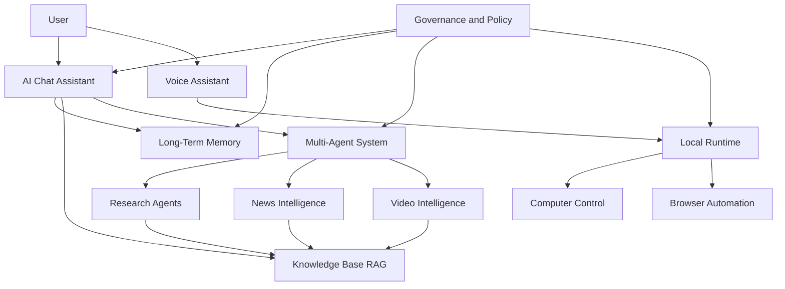

# JARVIS Features

## Planning Summary

JARVIS is a modular AI Operating System composed of user-facing experiences, memory systems, knowledge services, local automation capabilities, intelligence pipelines, and a governed multi-agent platform.

This document defines the major feature areas, their goals, responsibilities, future expansion paths, and risks.

## Feature Map

## AI Chat Assistant

### Goals

- Provide the primary conversational interface for JARVIS.
- Understand user intent across chat, files, workspace context, memory, knowledge, and tools.
- Support drafting, planning, summarization, reasoning, task management, and delegated actions.

### Responsibilities

- Maintain conversation state and message history.
- Route requests to the correct model, tool, memory source, or agent.
- Explain uncertainty and cite sources when knowledge retrieval is used.
- Ask for clarification or approval when intent is ambiguous or action is sensitive.
- Surface relevant memories and workspace context only when allowed by policy.

### Core Capabilities

- Natural language chat.
- Workspace-aware context.
- File and document Q&A.
- Tool-aware responses.
- Task creation and tracking.
- Source-cited answers.
- User feedback capture.

### Future Expansion Strategy

- Add multimodal chat with images, audio, video, screen context, and live browser state.
- Add personalized response style and role-specific assistant modes.
- Add agent handoff where the assistant can delegate to research, browser, or automation agents.
- Add organization-wide assistant templates with policy and tool bundles.

### Risks

- Generic assistant behavior may not feel differentiated.
- Context overload can reduce answer quality.
- Unclear boundaries between chat, agents, and automation can confuse users.
- Missing citations can weaken trust in knowledge-based answers.

## Long-Term Memory

### Goals

- Give JARVIS durable, user-controlled memory across sessions.
- Improve personalization, continuity, and task follow-through.
- Support user, workspace, and organization memory scopes.

### Responsibilities

- Store facts, preferences, projects, relationships, goals, decisions, and recurring workflows.
- Respect consent, policy, retention, and deletion settings.
- Separate personal memory from workspace and tenant memory.
- Retrieve memories only when relevant and authorized.
- Provide memory inspection, correction, and deletion.

### Core Capabilities

- Explicit memory save.
- Suggested memory with user approval.
- Memory search and recall.
- Memory confidence and provenance.
- Memory expiration and retention.
- Sensitive memory classification.

### Future Expansion Strategy

- Add episodic memory for important interactions and outcomes.
- Add semantic memory clustering by topic, project, and relationship.
- Add memory conflict detection when newer facts contradict older memories.
- Add enterprise memory controls for regulated teams.

### Risks

- Incorrect or stale memories can harm user experience.
- Over-retention can create privacy and compliance concerns.
- Silent memory creation can feel invasive.
- Cross-workspace leakage would be a critical trust failure.

## Voice Assistant

### Goals

- Make JARVIS available through natural voice interaction.
- Support quick commands, conversational queries, dictation, and hands-free workflows.
- Prepare for real-time local context and device-level actions.

### Responsibilities

- Capture audio through the local runtime.
- Convert speech to text with low latency.
- Convert responses to speech.
- Manage wake-word or push-to-talk settings.
- Confirm sensitive actions before execution.
- Respect microphone privacy and enterprise policies.

### Core Capabilities

- Streaming transcription.
- Text-to-speech.
- Voice command routing.
- Interruption handling.
- Voice activity detection.
- Confirmation prompts.

### Future Expansion Strategy

- Add full duplex conversation.
- Add speaker recognition where permitted.
- Add emotion and urgency detection only with explicit consent and clear policy.
- Add meeting participation, summaries, action items, and follow-ups.

### Risks

- Background audio creates privacy sensitivity.
- Poor latency makes the experience feel broken.
- Speech recognition errors can trigger incorrect actions.
- Voice identity and authentication require careful design.

## Computer Control

### Goals

- Allow JARVIS to operate approved desktop applications under user control.
- Support repetitive workflow automation, local file operations, and cross-app assistance.
- Provide a visible, interruptible control model.

### Responsibilities

- Observe screen state with explicit permission.
- Plan UI actions.
- Execute mouse, keyboard, window, and file interactions through the local runtime.
- Require approvals for sensitive actions.
- Record audit events for controlled sessions.
- Stop immediately when user revokes control.

### Core Capabilities

- Screen understanding.
- UI element targeting.
- Keyboard and mouse actions.
- Local file workflow assistance.
- Action preview and confirmation.
- Session interruption.

### Future Expansion Strategy

- Add app-specific automation adapters.
- Add macro recording and conversion into reusable workflows.
- Add rollback plans for supported operations.
- Add policy-based application allowlists and restricted actions.

### Risks

- UI state ambiguity can cause incorrect actions.
- Operating system permissions differ across platforms.
- Unsafe automation can alter or delete user data.
- Enterprises may restrict desktop control without strong governance.

## Browser Automation

### Goals

- Enable JARVIS to perform web workflows safely and reliably.
- Support research, data entry, web app navigation, form completion, and monitoring.
- Provide auditability and human approval for high-risk actions.

### Responsibilities

- Control browser sessions through approved automation channels.
- Understand page state and navigation.
- Respect domain policies, credentials, and data restrictions.
- Use dry-run previews for sensitive workflows.
- Capture evidence and logs for completed actions.

### Core Capabilities

- Browser navigation.
- Form interaction.
- Web page extraction.
- Session state management.
- Workflow replay.
- Domain-level permissions.

### Future Expansion Strategy

- Add resilient workflow definitions that survive minor UI changes.
- Add browser-based enterprise app connectors.
- Add scheduled web monitoring.
- Add credential vault integration.

### Risks

- Websites change frequently and can break automation.
- Credential handling introduces security obligations.
- Automated submissions can have legal or financial consequences.
- Anti-automation controls may limit reliability.

## Knowledge Base (RAG)

### Goals

- Ground JARVIS responses in documents, web pages, enterprise content, and user knowledge.
- Provide source-cited answers and retrieval transparency.
- Support workspace and tenant-level knowledge management.

### Responsibilities

- Ingest, parse, chunk, embed, index, and retrieve knowledge.
- Preserve source metadata, permissions, and freshness.
- Combine vector search, keyword search, and metadata filters.
- Return citations and confidence signals to consuming agents.
- Enforce access controls during retrieval.

### Core Capabilities

- Document ingestion.
- Web page ingestion.
- Chunking and embedding.
- Hybrid search.
- Citation generation.
- Source freshness tracking.
- Knowledge collection management.

### Future Expansion Strategy

- Add enterprise connectors for drives, wikis, tickets, CRM, and databases.
- Add knowledge graph extraction.
- Add automatic stale-content detection.
- Add evaluation workflows for answer groundedness.

### Risks

- Poor chunking can reduce retrieval quality.
- Unauthorized retrieval can expose sensitive data.
- Stale documents can produce outdated answers.
- Citation quality must be strong enough for enterprise trust.

## Research Agents

### Goals

- Conduct multi-step research with source tracking and synthesis.
- Support reports, comparisons, due diligence, technical research, and market analysis.
- Reduce manual browsing and note-taking.

### Responsibilities

- Plan research tasks.
- Search internal and external sources.
- Evaluate source credibility.
- Extract evidence.
- Synthesize findings into structured outputs.
- Preserve citations and reasoning trace.

### Core Capabilities

- Research planning.
- Query expansion.
- Source collection.
- Evidence extraction.
- Report generation.
- Research task progress.

### Future Expansion Strategy

- Add collaborative research teams with specialist agents.
- Add recurring research monitors.
- Add report templates by domain.
- Add integration with knowledge base and news intelligence.

### Risks

- Source credibility varies.
- Research agents can over-search and increase cost.
- Synthesis may hide uncertainty.
- External web data can be incomplete or misleading.

## News Intelligence

### Goals

- Monitor topics, companies, markets, risks, and industries.
- Provide briefings, alerts, trend analysis, and decision support.
- Help users distinguish signal from noise.

### Responsibilities

- Track user-defined watchlists.
- Ingest and normalize news sources.
- Cluster related stories.
- Score relevance, novelty, credibility, and urgency.
- Generate summaries and alerts.
- Maintain source attribution.

### Core Capabilities

- Watchlists.
- Topic monitoring.
- Daily briefings.
- Breaking alerts.
- Sentiment and trend analysis.
- Source clustering.

### Future Expansion Strategy

- Add executive intelligence briefings.
- Add competitive intelligence dashboards.
- Add market, regulatory, and geopolitical risk feeds.
- Add anomaly detection across monitored signals.

### Risks

- Alerts can become noisy.
- Sentiment models can be inaccurate.
- Source bias can shape summaries.
- News licensing and redistribution require legal review.

## Video Intelligence

### Goals

- Turn videos into searchable, summarized, and question-answerable knowledge.
- Support meetings, lectures, training, product demos, research videos, and security review where permitted.
- Preserve timestamp-level evidence.

### Responsibilities

- Ingest video assets.
- Extract audio, transcript, frames, scenes, speakers, and metadata.
- Index video content for retrieval.
- Generate summaries and answer questions with timestamp citations.
- Enforce media access, consent, and retention policies.

### Core Capabilities

- Video transcription.
- Speaker segmentation.
- Scene detection.
- Timeline search.
- Video summarization.
- Timestamp citations.

### Future Expansion Strategy

- Add multimodal event detection.
- Add meeting intelligence with decisions and action items.
- Add visual slide extraction.
- Add domain-specific video analysis models.

### Risks

- Video processing is expensive.
- Consent and privacy requirements are strict.
- Visual interpretation can be unreliable.
- Large media libraries require scalable storage lifecycle management.

## Multi-Agent System

### Goals

- Coordinate specialized agents for complex tasks.
- Support planning, delegation, execution, review, and synthesis.
- Provide governed autonomy with budgets, permissions, and auditability.

### Responsibilities

- Register available agents and capabilities.
- Select agents based on task needs.
- Coordinate agent communication and shared context.
- Enforce tool, data, autonomy, and budget policies.
- Track agent runs, decisions, and outputs.
- Evaluate agent performance.

### Core Capabilities

- Agent registry.
- Planner agent.
- Supervisor agent.
- Specialist agents.
- Task decomposition.
- Tool permissioning.
- Run history and replay.

### Future Expansion Strategy

- Add agent marketplace.
- Add team-specific agent templates.
- Add simulation and evaluation environments.
- Add cross-tenant extension governance.

### Risks

- Agent collaboration can be hard to debug.
- Multi-agent loops can increase cost and latency.
- Poor supervision can amplify errors.
- Tool misuse can create security and compliance problems.

## Cross-Feature Governance

All features must integrate with:

- Tenant and workspace isolation.
- Role-based access control.
- Policy engine.
- Audit logs.
- Consent and retention controls.
- Observability and cost tracking.
- Model and agent evaluation.
- Human approval workflows.

## Feature Maturity Model

JARVIS should move features through this maturity model gradually. High-risk capabilities should remain in suggest, draft, or confirmation modes until reliability, governance, and user trust are proven.
