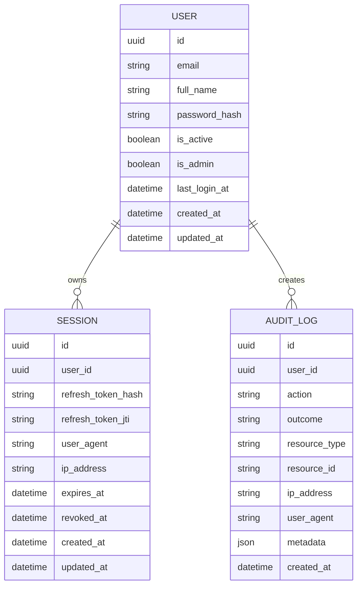
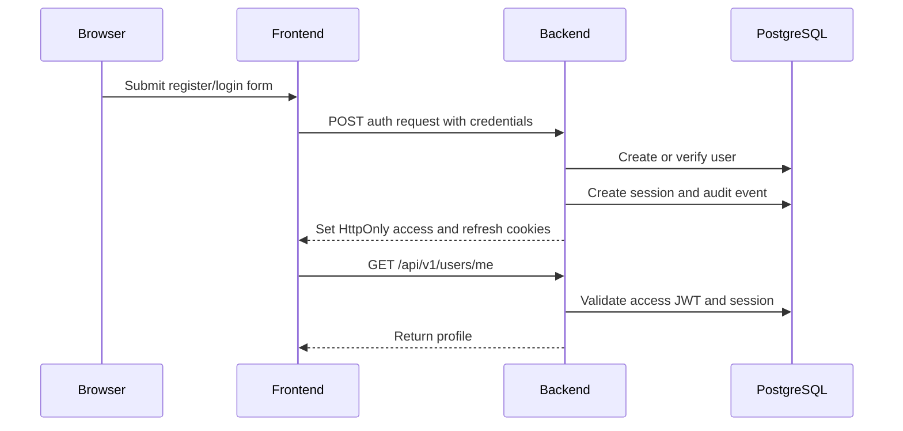

# Phase 3 Authentication And Control Plane

## Summary

Phase 3 implements the first secure control-plane slice for JARVIS: user identity, JWT sessions, audit logging, PostgreSQL persistence, and login/register/dashboard UI.

This phase intentionally does not implement memory, RAG, agents, browser automation, computer control, voice, or assistant business logic.

## Scope

Implemented:

- FastAPI auth endpoints.
- PostgreSQL-backed SQLAlchemy models.
- Alembic migration for `users`, `sessions`, and `audit_logs`.
- JWT access and refresh tokens stored in HttpOnly cookies.
- Argon2 password hashing.
- Open registration.
- Login, refresh, logout, and current-user profile flow.
- React login, register, and dashboard pages.
- Docker Compose startup for `postgres`, `backend`, and `frontend`.

Deferred:

- Tenants, workspaces, RBAC, and policy engine.
- Long-term memory and RAG.
- LangGraph agent execution.
- Browser automation and computer control.
- Voice assistant.

## Database Tables

## Auth Flow

## Security Notes

- Passwords are hashed with Argon2 via `pwdlib`.
- Access tokens default to 15 minutes.
- Refresh tokens default to 14 days and are backed by session rows.
- Logout revokes the active session and clears cookies.
- The frontend uses `credentials: "include"` and never stores JWTs directly.
- Production deployments must set a strong `JWT_SECRET_KEY` and enable secure cookies behind HTTPS.
