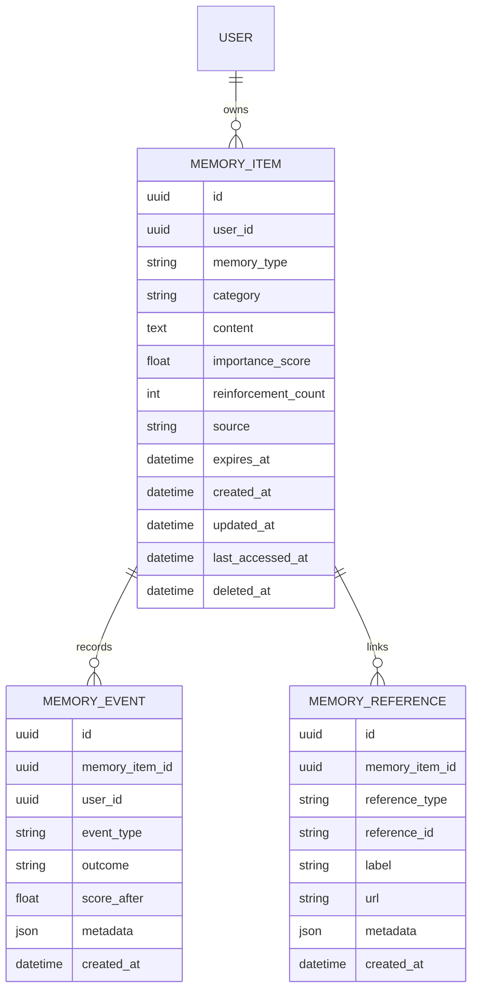

# Phase 4 Memory Engine

## Summary

Phase 4 adds the production foundation for JARVIS memory without implementing RAG, embeddings, vector search, agents, browser automation, or voice. Memories are explicit, authenticated, auditable relational records that can later feed retrieval, personalization, research, voice context, and knowledge graph features.

## Scope

Implemented:

- `memory_items`, `memory_events`, and `memory_references` tables.
- SQLAlchemy models and Alembic migration.
- Repository and service layer patterns.
- Authenticated memory APIs under `/api/v1/memory`.
- Keyword/category/type filtering and importance-ranked search.
- Short-term memory expiration support.
- Recall and reinforcement tracking.
- React Memory Dashboard for list, search, filter, detail, create, edit, delete, and reinforce workflows.

Deferred:

- Vector embeddings.
- Semantic retrieval.
- RAG ingestion and citations.
- Agent-created memories.
- Voice, browser automation, and computer control.

## Memory Types

| Type | Purpose |
| --- | --- |
| `short_term` | Temporary context with expiration support |
| `long_term` | Durable user facts and important information |
| `user_preference` | Learning style, UI, communication, and answer preferences |
| `project` | Project-specific facts and decisions |
| `correction` | User feedback, corrections, and preferred answer patterns |

## Schema



## API

- `POST /api/v1/memory`
- `GET /api/v1/memory`
- `GET /api/v1/memory/{id}`
- `PUT /api/v1/memory/{id}`
- `DELETE /api/v1/memory/{id}`
- `POST /api/v1/memory/search`
- `POST /api/v1/memory/reinforce`

All endpoints require the Phase 3 HttpOnly cookie authentication flow.

## Reinforcement

Recall and explicit reinforcement update:

- `reinforcement_count`
- `last_accessed_at`
- derived `memory_score`

The score is deterministic and bounded from 0 to 1. It combines configured importance with reinforcement history. Search remains relational and ranks by importance, reinforcement, access recency, and update recency.

## Risks

| Risk | Mitigation |
| --- | --- |
| Stale or incorrect memory | User-visible edit/delete and correction memory type |
| Over-retention | Expiration support and soft deletion |
| Unauthorized recall | User-scoped queries and authenticated endpoints |
| Future vector index drift | Phase 4 does not create embeddings; future derived indexes must honor deletion |
| Silent memory creation | Current API supports explicit memory management only |

## Migration

Run:

```bash
cd backend
alembic upgrade head
```

Docker Compose runs the same migration command automatically before Uvicorn starts.
