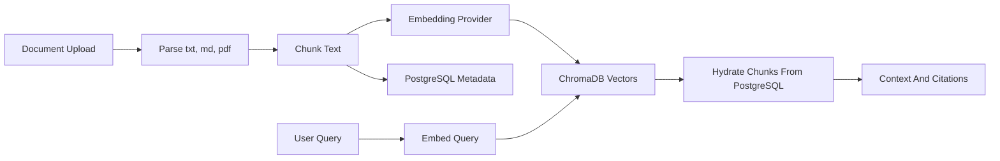
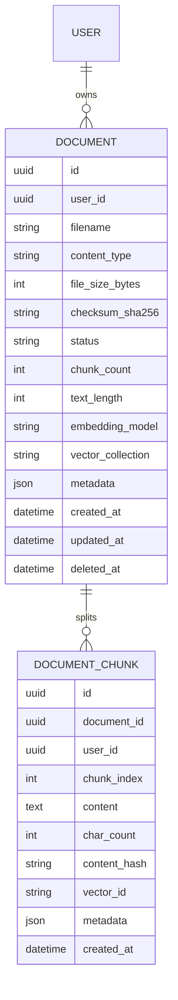
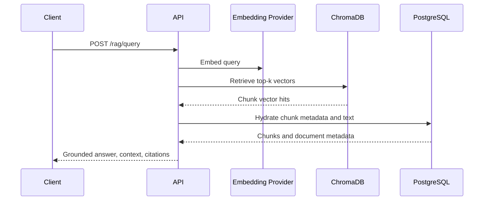

# Phase 5 RAG Knowledge Engine

## Summary

Phase 5 adds the first retrieval-augmented generation foundation for JARVIS. Users can upload supported documents, the backend parses and chunks them, embeddings are generated through a provider abstraction, vectors are stored in ChromaDB, and PostgreSQL keeps durable metadata for documents and chunks.

This phase returns grounded context and citations from uploaded knowledge. It does not implement autonomous agents, browser ingestion, voice, or advanced LLM synthesis.

## Architecture



## Scope

Implemented:

- `documents` and `document_chunks` relational tables.
- Alembic migration for document metadata.
- Parser support for `.txt`, `.md`, `.markdown`, and `.pdf`.
- Deterministic overlapping chunking.
- Embedding provider abstraction.
- Default embedding provider: `sentence-transformers/all-MiniLM-L6-v2`.
- ChromaDB vector storage and top-k retrieval.
- Chroma Python client and server pinned together at `1.5.9`.
- Authenticated document APIs.
- Authenticated RAG search/query APIs.
- Knowledge Base and Upload Document frontend pages.

Deferred:

- LLM-generated answer synthesis.
- Async ingestion workers.
- Workspace-scoped knowledge collections.
- Enterprise connector ingestion.
- Hybrid keyword/vector retrieval.
- Knowledge graph extraction.

## Schema



## API

- `POST /api/v1/documents/upload`
- `GET /api/v1/documents`
- `GET /api/v1/documents/{id}`
- `DELETE /api/v1/documents/{id}`
- `POST /api/v1/rag/search`
- `POST /api/v1/rag/query`

All endpoints require the Phase 3 HttpOnly cookie authentication flow.

## RAG Query Flow



## Risks

| Risk | Mitigation |
| --- | --- |
| Unsupported or malformed documents | Explicit parser validation and errors |
| Vector store drift from relational records | Chunk IDs and document IDs are stored in both systems |
| Chroma client/server protocol mismatch | Pin both components to `1.5.9` and upgrade them together |
| Unauthorized retrieval | User-scoped metadata filters and authenticated APIs |
| Large upload cost | Configurable upload size and chunk settings |
| Poor answer synthesis | Current phase returns grounded context and citations, not unsupported claims |

## Migration

Run:

```bash
cd backend
alembic upgrade head
```

Docker Compose runs migrations automatically before Uvicorn starts.
