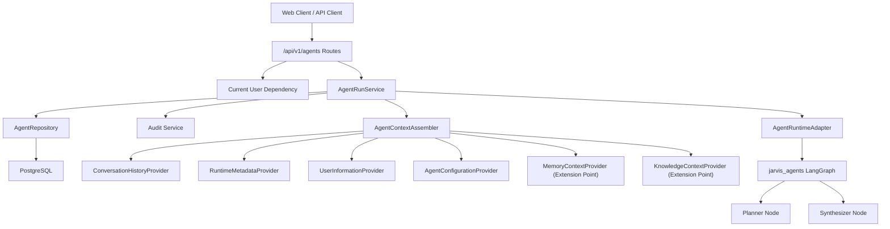
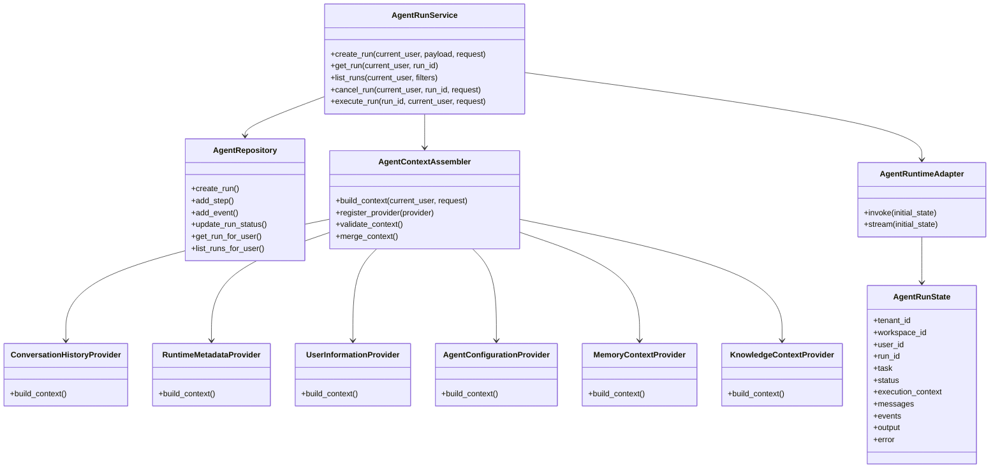
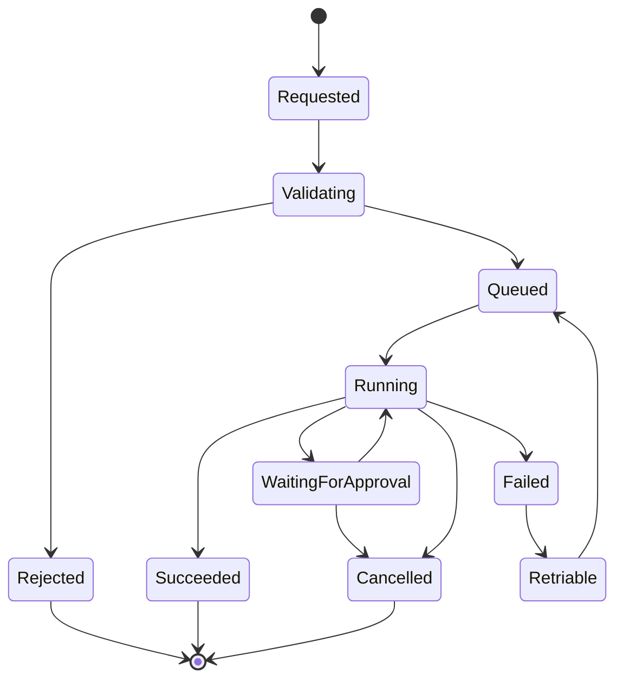
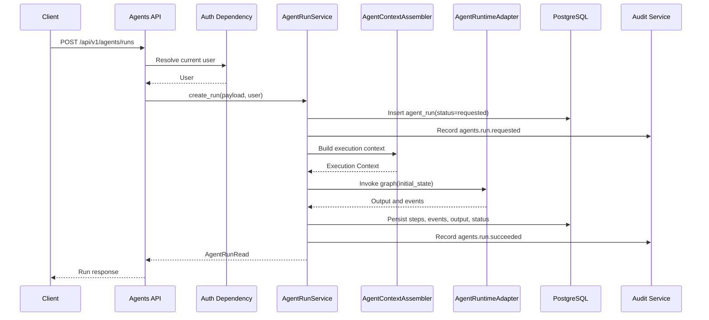

# Phase 6 Agent Framework Architecture

## Planning Summary

Phase 6 introduces the first governed AI Agent Framework foundation for JARVIS. The goal is to support agent run planning, state, context assembly, execution events, and LangGraph orchestration contracts without destabilizing completed Phase 0-5 work.

This is a design and implementation plan only. It does not implement Phase 6 behavior.

## Current Repository Observations

This plan is based on the current repository and Phase 0-5 implementation:

- FastAPI exposes versioned routes through `backend/app/api/router.py`.
- Authentication resolves users through `get_current_user` in `backend/app/api/dependencies.py`.
- Domain services use explicit dependencies such as `AsyncSession`, `Settings`, embedding providers, and vector stores.
- The Memory Engine is implemented under `backend/app/domains/memory` with relational records, events, references, search, recall, reinforcement, and audit logging.
- The RAG Knowledge Engine is implemented under `backend/app/domains/documents` with document parsing, chunking, embeddings, ChromaDB retrieval, confidence, citations, and extractive grounded answers.
- Governance audit logging exists in `backend/app/domains/governance/audit.py`.
- `backend/app/domains/agents` is currently reserved for agent definitions, runs, steps, approvals, tool executions, and evaluations.
- The top-level `agents` package contains the Phase 1 LangGraph scaffold with `AgentRunState` and `create_agent_graph()`.

Phase 6 should add an agent layer beside existing Memory and RAG services. It should not move Memory or RAG responsibilities into agent code.

## Goals

- Provide a production-grade foundation for user-requested agent runs.
- Persist agent definitions, runs, steps, events, context references, and outputs.
- Provide extensible context provider interfaces that allow future integration with Memory and RAG through stable service-layer adapters.
- Use LangGraph for orchestrated state transitions while keeping persistence, authorization, and audit in the backend.
- Support a synchronous MVP run path with a clean route to future async workers, streaming, and resumable runs.
- Preserve user isolation, current HttpOnly cookie authentication, auditability, and least-privilege data access.
- Keep Phase 6 independently testable and safe to release before browser automation, computer control, voice, or autonomous scheduling.

## Scope

Phase 6 should design and later implement:

- Agent run API resources under `/api/v1/agents`.
- Agent domain models for definitions, runs, steps, events, and artifacts.
- Backend services for validation, authorization, persistence, audit, context assembly, and runtime invocation.
- Extensible context provider interfaces and the Context Assembly pipeline. Concrete Memory and Knowledge provider integrations are implemented in later phases.
- A LangGraph runtime adapter that executes a minimal planner/synthesizer graph.
- Explicit lifecycle states and safe error transitions.
- Structured run events suitable for future streaming.
- Tests for API routes, services, repositories, context providers, and graph runtime behavior.

## Non-Goals

Phase 6 should not implement:

- Browser automation.
- Computer control.
- Voice assistant behavior.
- Autonomous scheduled agents.
- Multi-agent delegation beyond reserved interfaces.
- Tool marketplace or connector execution.
- New memory semantics or changes to existing Memory APIs.
- New RAG ingestion, vector store, or citation behavior.
- A full model provider gateway unless a narrow interface is needed for testable orchestration.
- Redesign of completed Phase 0-5 services.

## Architecture Overview

The Agent Framework sits above the existing platform capabilities and orchestrates the complete agent execution lifecycle while remaining independent of infrastructure-specific implementations.

- API routes accept authenticated agent run requests and delegate execution to the Agent domain.
- `AgentRunService` validates requests, creates durable run records, assembles execution context, invokes a runtime adapter, persists execution events, and returns typed responses.
- `AgentContextAssembler` coordinates registered context providers, validates and merges their output, and produces a single execution context for the runtime.
- During Phase 6.3, the Context Assembly layer supports the following providers:
  - Conversation History Provider
  - Runtime Metadata Provider
  - User Information Provider
  - Agent Configuration Provider
- The Context Assembly architecture is designed to support additional providers through extensible interfaces.
- `MemoryContextProvider` is defined as an extension point for supplying memory context to the Context Assembly pipeline. During Phase 6.3, it does **not** perform memory retrieval. Concrete Memory integration is implemented in **Phase 6.7 – Memory Integration**.
- `KnowledgeContextProvider` is defined as an extension point for supplying knowledge context to the Context Assembly pipeline. During Phase 6.3, it does **not** perform RAG retrieval. Concrete Knowledge (RAG) integration is implemented in **Phase 6.8 – Knowledge Integration**.
- `AgentRuntimeAdapter` converts backend runtime state into the runtime-specific execution state (for example, LangGraph) and converts execution results back into persistable backend models. Runtime implementations remain pluggable and framework-agnostic.
- The `agents` package remains a pure orchestration layer. It must not import FastAPI, SQLAlchemy, database models, ORM sessions, HTTP request objects, or any other infrastructure-specific implementation details. Infrastructure concerns are injected through interfaces and dependency injection.

## Component Diagram



## Folder Structure

Planned implementation folders should be introduced incrementally by milestone.

```text
backend/app/api/routes/
  agents.py

backend/app/domains/agents/
  README.md
  models.py
  schemas.py
  repository.py
  services.py
  context.py
  runtime.py
  errors.py
  policies.py

backend/alembic/versions/
  <phase_6_agent_framework_migration>.py

agents/src/jarvis_agents/
  state.py
  graph.py
  nodes.py
  prompts.py
  events.py
  errors.py

backend/tests/
  test_agents_api.py
  test_agents_repository.py
  test_agents_services.py
  test_agents_context.py
  test_agents_runtime.py

agents/tests/
  test_graph.py
  test_nodes.py
```

## Class Hierarchy


## Agent Lifecycle



| State | Responsibility |
| --- | --- |
| `requested` | Persist the authenticated user request. |
| `validating` | Check payload, limits, policy, and supported agent type. |
| `queued` | Reserve async execution semantics. MVP may transition immediately. |
| `running` | Execute graph nodes and persist run events. |
| `waiting_for_approval` | Reserve gated approval for future tool use. |
| `succeeded` | Persist final answer, citations, context references, and metrics. |
| `failed` | Persist structured error details and a safe user-facing message. |
| `cancelled` | Stop pending work and record audit/event entries. |
| `retriable` | Mark failures safe to retry without duplicate side effects. |

## Request Flow


## API Integration Strategy

Phase 6 should add routes without changing existing Memory, RAG, Auth, or User endpoints.

Proposed endpoints:

- `POST /api/v1/agents/runs`
- `GET /api/v1/agents/runs`
- `GET /api/v1/agents/runs/{run_id}`
- `POST /api/v1/agents/runs/{run_id}/cancel`
- `GET /api/v1/agents/runs/{run_id}/events`

MVP behavior:

- `POST /agents/runs` may execute synchronously and return the completed run.
- `GET /agents/runs/{run_id}/events` should return persisted events as a list.
- Streaming over SSE or WebSocket should be deferred until event persistence is stable.

Representative request:

```json
{
  "agent_type": "assistant",
  "task": "Summarize my uploaded knowledge about the deployment plan.",
  "context": {
    "include_conversation": true,
    "include_runtime": true,
    "include_user": true
}
}
```

Representative response:

```json
{
  "id": "agent-run-id",
  "agent_type": "assistant",
  "status": "succeeded",
  "task": "Summarize my uploaded knowledge about the deployment plan.",
  "output": "Concise grounded response.",
  "citations": [],
  "memory_references": [],
  "created_at": "timestamp",
  "updated_at": "timestamp"
}
```


## Dependency Injection Strategy

Phase 6 should follow the existing FastAPI dependency conventions and keep all dependencies explicit, testable, and replaceable.

General principles:

- Define route constants for `DB_SESSION_DEP`, `SETTINGS_DEP`, and `CURRENT_USER_DEP`.
- Add shared agent-specific providers in `backend/app/api/dependencies.py` only when multiple routes require them.
- Keep dependencies explicit in route signatures.
- Construct services using dependency injection rather than global state.
- Keep `AgentRuntimeAdapter` behind a dependency so tests can replace it with fakes or mock implementations.
- Keep `AgentContextAssembler` independent of infrastructure-specific implementations.

### Proposed Providers

- `get_agent_runtime_adapter(settings)`
- `get_agent_context_assembler(settings)`
- `get_agent_policy(settings)`

During Phase 6.3, `AgentContextAssembler` should assemble context only from the providers implemented in this milestone:

- Conversation History Provider
- Runtime Metadata Provider
- User Information Provider
- Agent Configuration Provider

`MemoryContextProvider` and `KnowledgeContextProvider` are registered as extension interfaces only. They do not require Memory, RAG, embedding, or vector store dependencies during this milestone. Concrete dependency injection for Memory and Knowledge providers is introduced in:

- Phase 6.7 – Memory Integration
- Phase 6.8 – Knowledge Integration

### Avoid

- Global mutable graph state.
- Direct database access from graph nodes.
- FastAPI imports inside the `agents` package.
- SQLAlchemy imports inside the `agents` package.
- Passing `Request` objects into graph nodes.
- Coupling `AgentContextAssembler` directly to Memory or RAG infrastructure before their respective integration phases.

## Error Handling

Phase 6 should use domain-specific exceptions and route-level translation, matching Memory and RAG patterns.

Proposed exceptions:

- `AgentValidationError`
- `AgentNotFoundError`
- `AgentPolicyDeniedError`
- `AgentRuntimeError`
- `AgentTimeoutError`
- `AgentCancelledError`

HTTP mapping:

| Exception | HTTP status | User-facing behavior |
| --- | --- | --- |
| `AgentValidationError` | 400 | Show actionable request issue. |
| `AgentPolicyDeniedError` | 403 | Explain permission or policy denial without leaking internals. |
| `AgentNotFoundError` | 404 | Return generic not found. |
| `AgentTimeoutError` | 504 | Mark run failed or retriable. |
| `AgentRuntimeError` | 503 | Mark run failed with safe message. |
| Unexpected exception | 500 | Mark run failed, audit, and log exception. |

Graph errors should be captured as run events and summarized safely. Internal prompts, hidden reasoning, stack traces, and provider payloads should not be returned to clients.

## Logging Strategy

Logging should extend the existing `configure_logging()` foundation with structured fields where possible.

Required log fields:

- `request_id`
- `user_id`
- `agent_run_id`
- `agent_type`
- `status`
- `event_type`
- `duration_ms`
- `error_code`

Audit events:

- `agents.run.requested`
- `agents.run.started`
- `agents.run.succeeded`
- `agents.run.failed`
- `agents.run.cancelled`


Do not log:

- Access or refresh tokens.
- Full memory contents at info level.
- Full uploaded document snippets at info level.
- Hidden model reasoning or private graph internals.

## Testing Strategy

Testing should be layered and milestone-specific.

### Backend Unit Tests

- Validate agent schema constraints and lifecycle transitions.
- Verify repository queries are user-scoped.
- Verify service creates runs, records events, updates statuses, and audits actions.
- Verify domain exceptions map to API responses.

### Context Integration Tests

- Test Conversation Provider

- Test Runtime Provider

- Test User Provider

- Test Config Provider

- Test Context Merge

- Test Validation

- Test Limits


### Runtime Tests

- Test LangGraph state transitions with deterministic fake nodes.
- Verify graph output includes status, events, context references, and final output.
- Verify runtime errors become structured failure events.

### API Tests

- `POST /agents/runs` requires authentication.
- A valid request creates a run and returns a typed response.
- A run is visible only to its owner.
- Events can be listed.
- Cancellation works for cancellable states.

### Regression Tests

- Existing Memory tests remain unchanged and passing.
- Existing RAG tests remain unchanged and passing.
- Agent tests use service adapters and avoid Memory/RAG internals.

## Security Considerations

- All agent endpoints must require current user authentication.
- Agent runs must be user-scoped until tenants/workspaces are implemented.
- Agents must not create, edit, or delete memories in Phase 6.
- Agents must not upload, delete, or mutate knowledge sources in Phase 6.
- Tool execution is out of scope and denied by default.
- Context assembly should enforce size limits.
- Audit every run state transition and context retrieval summary.
- Store safe summaries and references instead of unnecessary raw sensitive context.
- Keep approval states in the lifecycle even while tool approvals are deferred.

## Scalability Considerations

Phase 6 can begin synchronously, but the architecture must not prevent async scale.

Short-term:

- Bounded context sizes.
- Bounded run duration.
- Bounded event counts.
- Idempotent request IDs where possible.

Medium-term:

- Move execution to a worker queue.
- Add run leasing and heartbeat timestamps.
- Add resumable LangGraph checkpoints.
- Stream run events to clients.

Long-term:

- Partition agent runs by tenant/workspace.
- Store high-volume events in append-only event storage.
- Separate orchestration workers from API containers.


## Future Extensibility

Phase 6 should reserve extension points for:

- Multi-agent supervisor/specialist delegation.
- Tool registry, with policy-gated tool execution introduced separately after registry contracts are established.
- Browser automation and computer control agents.
- Research and news intelligence agents.
- Voice-triggered agent runs.
- Workspace-scoped agents.
- Agent templates and user-configurable agent profiles.
- Evaluators for groundedness, memory use, policy compliance, and output quality.
- Event streaming and long-running background jobs.

## Implementation Milestones

Phase 6 is implemented incrementally. Each milestone establishes one architectural capability and must remain independently testable.

Later milestones may depend on contracts introduced by earlier milestones, but they must not prematurely implement functionality assigned to future milestones.

### Milestone 1: Agent Domain Foundation

Status: **Completed**

Purpose:

Establish the persistent domain model and lifecycle foundation required for governed agent execution.

Deliverables:

- Agent definitions.
- Agent runs.
- Agent steps.
- Agent events.
- Agent artifacts.
- Agent lifecycle policies.
- Validation limits.
- Agent-domain errors.
- Owner-scoped repositories.
- Agent services.
- PostgreSQL persistence.
- Alembic migration.
- Domain and repository tests.

Acceptance criteria:

- Agent resources are persistable and owner-scoped.
- Lifecycle transitions are explicitly controlled.
- Repository and service boundaries follow existing JARVIS conventions.
- No runtime execution is introduced.
- Existing Phase 0–5 functionality remains unchanged.

Implemented as:

`Phase 6.1 – Agent Domain Foundation`

Suggested commit:

`feat(agents): add Phase 6.1 agent domain foundation`

---

### Milestone 2: Agent Runtime Abstraction

Status: **Completed**

Purpose:

Define a framework-agnostic execution contract for future agent runtime implementations.

Deliverables:

- Runtime interface.
- Runtime context.
- Runtime execution model.
- Runtime result model.
- Runtime event model.
- Runtime status model.
- Runtime lifecycle.
- Runtime validation.
- Runtime factory.
- Runtime dependency injection.
- Timeout handling.
- Cancellation handling.
- Retryable failure handling.
- Runtime tests.

Acceptance criteria:

- Runtime contracts remain independent of LangGraph.
- Runtime implementations are replaceable.
- Runtime behavior is fully typed.
- Runtime lifecycle transitions are validated.
- No planner, executor, LLM, Memory, or RAG integration is introduced.

Implemented as:

`Phase 6.2 – Agent Runtime Abstraction`

Suggested commit:

`feat(runtime): implement Phase 6.2 Agent Runtime Abstraction`

---

### Milestone 3: Context Assembly

Status: **Completed**

Purpose:

Build the framework-agnostic Context Assembly pipeline responsible for constructing validated execution context before runtime execution.

Deliverables:

- `AgentContextAssembler`.
- Context builder.
- Typed context models.
- Context metadata.
- Async context provider interfaces.
- Provider registry.
- Conversation History Provider.
- Runtime Metadata Provider.
- User Information Provider.
- Agent Configuration Provider.
- Deterministic priority-based merge strategy.
- Context validation.
- Duplicate-provider detection.
- Required-section validation.
- JSON validation.
- Context size limits.
- `MemoryContextProvider` extension interface.
- `KnowledgeContextProvider` extension interface.
- Unit tests.

Acceptance criteria:

- Context Assembly produces a validated execution context.
- Providers can be registered and composed.
- Provider ordering and merging are deterministic.
- `MemoryContextProvider` exists only as an extension interface.
- `KnowledgeContextProvider` exists only as an extension interface.
- No Memory retrieval is implemented.
- No RAG retrieval is implemented.
- No agent execution is introduced.

Implemented as:

`Phase 6.3 – Context Assembly`

Suggested commit:

`feat(context): implement Phase 6.3 Context Assembly`

---

### Milestone 4: Tool Registry

Status: **Planned**

Purpose:

Establish the framework-agnostic registry and contracts required to describe, validate, register, and discover tools that future Planner and Executor milestones may use.

This milestone defines tool capabilities and discovery only. It does not execute tools.

Deliverables:

- Tool definition model.
- Tool metadata model.
- Tool capability/category representation where required.
- Tool input contract representation.
- Tool output contract representation.
- Tool interface or protocol.
- Tool registry.
- Tool registration.
- Tool lookup.
- Tool discovery/listing.
- Duplicate registration protection.
- Tool validation.
- Tool-specific errors.
- Registry policies and limits where required.
- Dependency injection integration where required.
- Unit tests.

Acceptance criteria:

- Tools have stable, typed contracts.
- Tools can be explicitly registered.
- Registered tools can be retrieved and discovered.
- Invalid definitions are rejected.
- Duplicate registration is rejected.
- Registry behavior is deterministic.
- Registry core remains framework agnostic.
- No tool execution is implemented.
- No planner behavior is implemented.
- No executor behavior is implemented.
- No LangGraph tool nodes are implemented.
- No concrete browser, shell, filesystem, connector, or external API tools are introduced.

Implemented as:

`Phase 6.4 – Tool Registry`

Suggested commit:

`feat(tools): implement Phase 6.4 Tool Registry`

---

### Milestone 5: Planner

Status: **Planned**

Purpose:

Introduce the planning layer responsible for transforming an agent task and assembled execution context into a structured execution plan.

The Planner decides what should be done. It does not perform the work itself.

Deliverables:

- Planner interface.
- Planning request model.
- Execution plan model.
- Plan step model.
- Planner validation.
- Planner policies and limits.
- Tool-awareness through Tool Registry contracts.
- Deterministic planner implementation or test double where required for testing.
- Planner errors.
- Unit tests.

Acceptance criteria:

- Planner accepts a task and validated execution context.
- Planner produces a typed execution plan.
- Plan steps are deterministic and validated.
- Planner may discover available tool contracts through the Tool Registry.
- Planner does not execute tools.
- Planner does not directly mutate agent persistence.
- Planner remains independent from concrete LLM providers.
- No Executor functionality is implemented.
- No Memory or RAG integration is introduced.

Implemented as:

`Phase 6.5 – Planner`

Suggested commit:

`feat(planner): implement Phase 6.5 Planner`

---

### Milestone 6: Executor

Status: **Planned**

Purpose:

Introduce the execution layer responsible for processing validated execution plans through governed execution contracts.

The Executor performs plan progression but must remain bounded by explicit lifecycle, policy, and tool-execution boundaries.

Deliverables:

- Executor interface.
- Execution request model.
- Execution result model.
- Plan-step execution lifecycle.
- Execution validation.
- Failure handling.
- Cancellation handling.
- Execution events.
- Policy boundaries for future tool invocation.
- Unit tests.

Acceptance criteria:

- Executor accepts validated execution plans.
- Execution progression is explicit and observable.
- Failures are represented through typed results and events.
- Cancellation behavior is deterministic.
- Executor does not bypass Tool Registry contracts.
- Concrete autonomous tool execution is not introduced unless separately authorized by architecture.
- No Memory retrieval is implemented.
- No RAG retrieval is implemented.
- No API routes or frontend execution flows are introduced.

Implemented as:

`Phase 6.6 – Executor`

Suggested commit:

`feat(executor): implement Phase 6.6 Executor`

---

### Milestone 7: Memory Integration

Status: **Planned**

Purpose:

Connect the existing JARVIS Memory Engine to Context Assembly through the previously reserved `MemoryContextProvider` extension point.

This milestone integrates with the existing Memory Engine. It must not redesign or duplicate Memory Engine behavior.

Deliverables:

- Concrete `MemoryContextProvider`.
- User-scoped memory retrieval.
- Bounded memory context.
- Memory-context metadata and references.
- Retrieval limits and policies.
- Integration with `AgentContextAssembler`.
- Memory integration errors where required.
- Unit and integration tests.

Acceptance criteria:

- Memory retrieval uses existing Memory service boundaries.
- Retrieval remains user-scoped.
- Context size remains bounded.
- Memory references are preserved in assembled context.
- Existing Memory behavior is not redesigned.
- Agent execution does not silently create memories.
- Existing Phase 4 Memory tests continue passing.
- No Knowledge/RAG integration is introduced.

Implemented as:

`Phase 6.7 – Memory Integration`

Suggested commit:

`feat(agents): integrate Memory context provider`

---

### Milestone 8: Knowledge (RAG) Integration

Status: **Planned**

Purpose:

Connect the existing JARVIS Knowledge/RAG Engine to Context Assembly through the previously reserved `KnowledgeContextProvider` extension point.

This milestone consumes the existing RAG service layer rather than duplicating retrieval infrastructure.

Deliverables:

- Concrete `KnowledgeContextProvider`.
- User-scoped knowledge retrieval.
- Bounded knowledge context.
- Document and chunk references.
- Citation preservation.
- Confidence metadata where available.
- Integration with `AgentContextAssembler`.
- Knowledge integration errors where required.
- Unit and integration tests.

Acceptance criteria:

- Retrieval uses existing RAG service boundaries.
- Document ownership filters remain enforced.
- Citations are preserved.
- Retrieval context remains bounded.
- Existing RAG ingestion and vector-store behavior is not modified.
- Existing Phase 5 RAG tests continue passing.
- No unrelated agent functionality is introduced.

Implemented as:

`Phase 6.8 – Knowledge (RAG) Integration`

Suggested commit:

`feat(agents): integrate Knowledge context provider`

---

### Milestone 9: Agent API And End-to-End Integration

Status: **Planned**

Purpose:

Connect the completed Agent Domain, Runtime, Context Assembly, Tool Registry, Planner, Executor, Memory integration, and Knowledge integration through authenticated API resources.

This milestone exposes the governed agent execution lifecycle to clients.

Deliverables:

- Agent run API routes.
- Authenticated run creation.
- Run inspection.
- Run listing.
- Cancellation.
- Event inspection.
- Service orchestration across completed Phase 6 components.
- Durable run status transitions.
- Audit events.
- End-to-end tests.
- API documentation updates.

Initial endpoints may include:

- `POST /api/v1/agents/runs`
- `GET /api/v1/agents/runs`
- `GET /api/v1/agents/runs/{run_id}`
- `POST /api/v1/agents/runs/{run_id}/cancel`
- `GET /api/v1/agents/runs/{run_id}/events`

Acceptance criteria:

- Authenticated users can create and inspect their own runs.
- User isolation is enforced.
- Context Assembly is invoked through its service boundary.
- Planner and Executor are invoked through explicit contracts.
- Memory and Knowledge context use their completed provider integrations.
- Run events and final status are persisted.
- Audit events are recorded.
- Failure paths return safe typed responses.
- Existing Phase 0–5 behavior remains unchanged.

Implemented as:

`Phase 6.9 – Agent API And End-to-End Integration`

Suggested commit:

`feat(agents): expose governed agent execution API`
## Release Gate Checklist

Before Phase 6 is released:

- Existing Phase 3 auth tests pass.
- Existing Phase 4 memory tests pass.
- Existing Phase 5 RAG tests pass.
- New backend agent tests pass.
- New `agents` package tests pass.
- Frontend build passes if frontend pages are included.
- Docker Compose starts backend, frontend, Postgres, and Chroma.
- A runtime smoke can register/login, create an agent run, retrieve events, and inspect output.
- No browser automation, computer control, voice, or autonomous scheduled behavior is accidentally exposed.

## Final Architecture Position

Phase 6 establishes the foundation for JARVIS to become an agent-capable platform while remaining safe, modular, and production-ready.

The foundation consists of a governed run model, a durable execution lifecycle, a modular Context Assembly pipeline, and a replaceable LangGraph runtime boundary.

Context Assembly is intentionally designed around extensible provider interfaces so that future phases can integrate Memory, Knowledge (RAG), tools, and additional context sources without changing the core orchestration architecture.

This incremental design allows JARVIS to evolve toward advanced multi-agent systems while preserving the stability of the completed Phase 0–5 platform.
