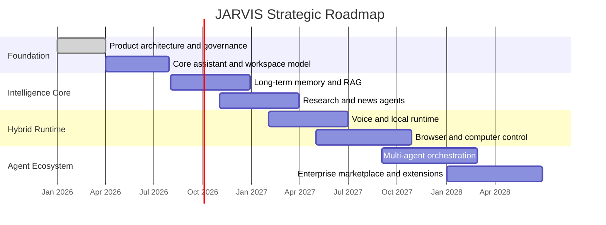
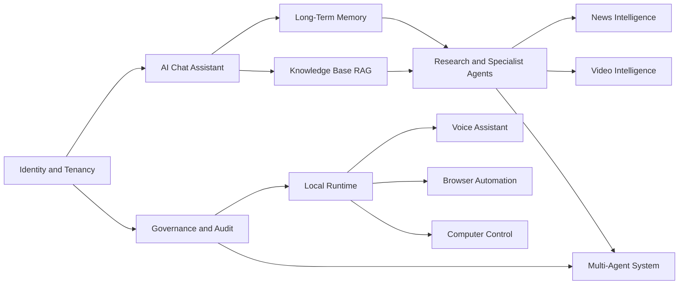

# JARVIS Roadmap

## Planning Summary

The JARVIS roadmap progresses from a secure AI assistant foundation to a hybrid AI Operating System with long-term memory, knowledge retrieval, voice, computer control, browser automation, intelligence pipelines, and a governed multi-agent ecosystem.

The roadmap separates delivery into phases so foundational trust, governance, and platform primitives are established before higher-autonomy capabilities are introduced.

## Roadmap Principles

- Build the control plane before broad autonomy.
- Ship narrow, reliable workflows before open-ended agent execution.
- Treat memory, identity, permissions, audit, and observability as foundational platform systems.
- Prefer modular services and agent contracts that support future replacement or specialization.
- Introduce riskier capabilities such as computer control and autonomous browser workflows through gated permissions and human approval.

## Phase Overview

Dates are illustrative planning anchors. Actual scheduling should be driven by team capacity, compliance requirements, model capability, and customer validation.

## Phase 0: Product And Architecture Foundation

### Goals

- Define the enterprise AI OS vision, system architecture, trust model, and product boundaries.
- Establish core documentation, technical design principles, and governance expectations.
- Identify primary personas, high-value workflows, and initial risk posture.

### Responsibilities

- Create architecture, API, data, security, and roadmap documentation.
- Define non-negotiable platform principles: multi-tenancy, RBAC, auditability, encryption, observability, and policy-based tool access.
- Establish initial success metrics and product evaluation criteria.

### Entry Criteria

- Product vision is approved.
- Key capabilities and platform assumptions are documented.
- Initial architecture can support local and cloud components.

### Exit Criteria

- Documentation baseline exists.
- Engineering teams can begin implementation planning without resolving core product ambiguity.
- Security and governance requirements are represented in architecture decisions.

### Risks

- Vision becomes too broad for practical execution.
- Architecture overfits future use cases before MVP learning.
- Governance requirements are underspecified and become expensive to retrofit.

## Phase 1: Core Assistant And Workspace Platform

### Goals

- Deliver the first usable AI chat assistant experience.
- Establish users, tenants, workspaces, conversations, messages, roles, permissions, and audit logs.
- Provide a reliable API and web experience for conversation and task management.

### Core Capabilities

- AI chat assistant with conversation history.
- Workspace-scoped context and permissions.
- Tenant-aware identity and access control.
- Basic file and document ingestion.
- Audit trail for user actions and assistant outputs.
- Admin controls for workspace membership and policy defaults.

### Responsibilities

- Provide the first stable product surface.
- Build the control plane needed by future services.
- Introduce basic model routing, prompt orchestration, logging, and safety filters.

### Dependencies

- Identity provider integration.
- Model provider abstraction.
- Core database and audit schema.
- Observability stack.

### Release Criteria

- Users can create workspaces and conversations.
- Assistants can respond with reliable latency and traceable conversation history.
- Admins can manage users, roles, and basic policies.
- All assistant responses and major user actions are auditable.

### Risks

- Chat-only MVP may feel too generic.
- Poor workspace modeling can limit future enterprise support.
- Missing observability can hide quality and cost problems.

## Phase 2: Long-Term Memory And Knowledge Base

### Goals

- Add consent-based long-term memory for user and workspace context.
- Provide retrieval-augmented generation over documents, notes, web pages, and enterprise knowledge.
- Give users visibility and control over stored memories and indexed knowledge.

### Core Capabilities

- User memory profile.
- Workspace memory.
- Memory creation, review, update, deletion, and policy enforcement.
- Knowledge ingestion pipelines.
- Vector search, hybrid search, citation retrieval, and source freshness tracking.
- Grounded assistant answers with source references.

### Responsibilities

- Improve continuity across sessions.
- Ground answers in reliable user and workspace knowledge.
- Support memory governance and data retention.

### Dependencies

- Memory data model.
- Vector database or vector extension.
- Document parsing and chunking pipeline.
- Data retention policy engine.

### Release Criteria

- Users can inspect and delete memories.
- Knowledge answers include citations.
- Retrieval quality is measured with evaluation datasets.
- Tenant and workspace access boundaries are enforced during retrieval.

### Risks

- Incorrect memory persistence can damage trust.
- Weak retrieval quality can produce confident but ungrounded answers.
- Data leakage across tenants or workspaces would be severe.

## Phase 3: Research Agents And News Intelligence

### Goals

- Introduce specialized agents for research, monitoring, synthesis, and news intelligence.
- Support long-running tasks with progress tracking, source capture, and final reports.
- Add scheduled intelligence briefs and alerts.

### Core Capabilities

- Research agent for multi-step web and knowledge-base research.
- News intelligence agent for topic, company, market, and risk monitoring.
- Source registry with credibility, recency, and citation metadata.
- Task queue for long-running agent work.
- Human approval for publishing, sending, or acting on findings.

### Responsibilities

- Move JARVIS from reactive assistant to proactive intelligence system.
- Maintain evidence trails for agent conclusions.
- Support analyst workflows and executive briefings.

### Dependencies

- Browser/search connectors.
- Task orchestration service.
- Source quality scoring.
- Notification system.

### Release Criteria

- Agents can produce research reports with citations.
- Users can schedule recurring briefs.
- News alerts include source links, confidence, and rationale.
- Long-running tasks survive retries and partial failures.

### Risks

- Source quality may vary significantly.
- Agent loops can increase cost and latency.
- News alerts can become noisy without ranking and personalization.

## Phase 4: Voice Assistant And Local Runtime

### Goals

- Deliver a local JARVIS runtime for voice, local context, and device-level integrations.
- Support conversational voice interactions with confirmation gates for sensitive actions.
- Prepare for computer control and browser automation.

### Core Capabilities

- Streaming speech-to-text.
- Text-to-speech responses.
- Wake-word or push-to-talk activation.
- Local context capture with explicit permissions.
- Secure local-cloud session bridge.
- Device registration and policy enforcement.

### Responsibilities

- Provide low-latency, natural interaction.
- Protect local data and device permissions.
- Support offline or degraded behavior where possible.

### Dependencies

- Desktop runtime.
- Secure device identity.
- Audio pipeline.
- Local permission manager.
- Streaming APIs.

### Release Criteria

- Voice loop meets target latency.
- Users can configure microphone, voice, and privacy settings.
- Sensitive actions require confirmation.
- Local runtime can be remotely governed by enterprise policy.

### Risks

- Voice latency can break user trust.
- Background listening creates privacy concerns.
- Local runtime complexity can slow cross-platform delivery.

## Phase 5: Browser Automation And Computer Control

### Goals

- Enable JARVIS to operate browsers and computers under controlled, auditable conditions.
- Support workflow automation across web applications, files, and desktop tasks.
- Introduce tool sandboxes and approval workflows.

### Core Capabilities

- Browser automation agent.
- Computer control agent.
- Screen understanding and UI interaction planning.
- Session recording and audit events.
- Dry-run previews for sensitive operations.
- Policy-based restrictions by app, domain, action type, and data class.

### Responsibilities

- Execute user-approved workflows safely.
- Provide recovery paths when automation fails.
- Maintain visible control boundaries between user and agent.

### Dependencies

- Local runtime maturity.
- Tool permission model.
- Automation sandbox.
- Secure credential handling.
- Action replay and audit logging.

### Release Criteria

- Agents can complete selected browser workflows reliably.
- Users can interrupt or revoke control.
- High-risk actions require explicit approval.
- Automation events are visible in audit logs.

### Risks

- UI changes can break workflows.
- Unauthorized or accidental actions could have real-world consequences.
- Credential handling requires strict security controls.

## Phase 6: Video Intelligence And Multimodal Understanding

### Goals

- Add ingestion, indexing, summarization, search, and analysis for video and other rich media.
- Support meeting analysis, training content, surveillance review where permitted, and media research.

### Core Capabilities

- Video ingestion and metadata extraction.
- Transcription and speaker segmentation.
- Scene, object, slide, and event detection.
- Timeline-based search and citations.
- Video summaries and question answering.

### Responsibilities

- Turn media into searchable, governed knowledge.
- Preserve source context and timestamps.
- Enforce privacy and compliance requirements for media data.

### Dependencies

- Media storage.
- Transcription services.
- Multimodal model support.
- Knowledge indexing pipeline.

### Release Criteria

- Users can search and summarize indexed videos.
- Answers include timestamp citations.
- Media retention and access policies are enforced.
- Processing jobs are observable and resumable.

### Risks

- Media processing costs can be high.
- Privacy and consent requirements vary by jurisdiction.
- Multimodal models can misinterpret visual evidence.

## Phase 7: Multi-Agent System And Enterprise Ecosystem

### Goals

- Mature JARVIS into a governed multi-agent platform.
- Support agent templates, skills, workflows, connectors, evaluations, and policy packs.
- Enable teams to deploy specialized agents safely.

### Core Capabilities

- Agent registry.
- Planner and supervisor agents.
- Specialist agent collaboration.
- Agent memory and tool policies.
- Workflow templates.
- Evaluation and simulation environments.
- Connector marketplace.

### Responsibilities

- Coordinate complex missions across agents.
- Control cost, permissions, tool access, and data boundaries.
- Provide reusable patterns for enterprise teams.

### Dependencies

- Stable orchestration layer.
- Agent lifecycle management.
- Policy engine.
- Evaluation harness.
- Marketplace governance.

### Release Criteria

- Teams can create, configure, and govern specialized agents.
- Agent runs are traceable, replayable, and measurable.
- Policies control agent tools, memory, data access, and autonomy level.
- Marketplace submissions pass security and quality review.

### Risks

- Multi-agent systems can become difficult to debug.
- Poorly governed extensions can create security risks.
- Cost and latency can grow quickly with agent collaboration.

## Cross-Phase Capability Dependencies

## Delivery Governance

Every phase should include:

- Security review.
- Privacy review.
- Architecture review.
- Model and agent evaluation.
- Observability readiness.
- Cost modeling.
- Abuse-case review.
- Documentation updates.

## Future Expansion Strategy

After the core roadmap, JARVIS can expand into:

- Industry-specific agent packs for legal, finance, healthcare, manufacturing, education, and cybersecurity.
- Enterprise knowledge graph integration.
- Personal AI continuity across devices.
- Federated or private-cloud deployments.
- Autonomous operations centers for IT, security, research, and executive intelligence.
- Third-party skill and connector ecosystem.

## Roadmap Risks

| Risk | Impact | Mitigation |
| --- | --- | --- |
| Scope expansion across many advanced AI domains | Delayed product-market validation | Sequence by platform dependency and user value |
| Premature autonomy | Trust, safety, and compliance failures | Require staged autonomy and human approval gates |
| Weak platform primitives | Expensive rework in later phases | Build identity, policy, memory, audit, and orchestration early |
| Poor evaluation discipline | Regressions in agent quality | Maintain evaluation datasets, runbooks, and quality dashboards |
| Cost escalation | Unsustainable margins | Add model routing, caching, budgets, quotas, and workload observability |
| Fragmented user experience | Users perceive tools instead of one assistant | Maintain unified assistant UX and shared context model |
