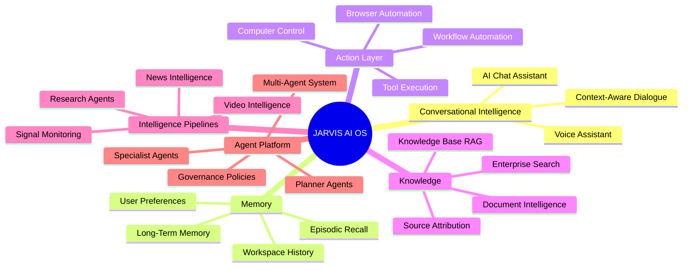
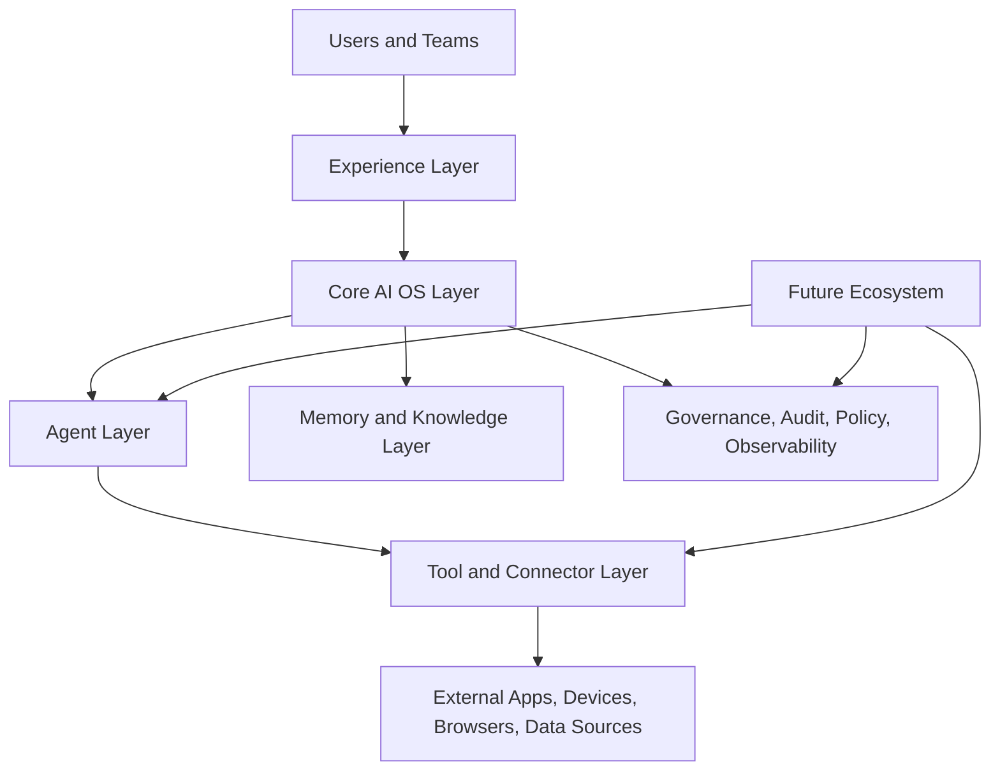

# JARVIS Vision

## Planning Summary

JARVIS is an AI Operating System inspired by Tony Stark's JARVIS: a trusted, always-available intelligence layer that helps people think, plan, communicate, research, operate computers, automate browsers, understand media, and coordinate specialized AI agents.

The platform is designed as a hybrid system. A local runtime handles privacy-sensitive, device-level capabilities such as voice interaction, computer control, browser automation, and local context capture. Cloud services provide scalable orchestration, long-term memory, knowledge retrieval, research agents, media intelligence, news intelligence, enterprise governance, and multi-agent coordination.

This document defines the product vision, operating principles, success criteria, expansion strategy, and strategic risks for JARVIS.

## Mission

Build an enterprise-grade AI Operating System that becomes the user's intelligent command layer across devices, applications, data, workflows, and external knowledge.

JARVIS should feel like a single coherent assistant while operating as a secure, modular platform behind the scenes. It should understand user intent, retain useful context with consent, coordinate specialized agents, and safely perform work across digital environments.

## Product Principles

1. **Trust before autonomy**
   JARVIS must earn permission before taking meaningful action. The system should explain decisions, request approval for sensitive operations, and maintain auditable records.

2. **Hybrid by design**
   Local execution protects personal context and enables device control. Cloud execution provides scale, collaboration, durable memory, and advanced intelligence pipelines.

3. **Memory with consent**
   Long-term memory should be explicit, inspectable, editable, revocable, and scoped by user, workspace, tenant, and policy.

4. **Composable intelligence**
   Capabilities should be delivered through modular agents, tools, memory services, knowledge systems, and orchestration policies rather than one monolithic assistant.

5. **Enterprise readiness from day one**
   Identity, access control, auditability, encryption, observability, tenant isolation, policy management, and compliance posture are core architecture concerns, not later add-ons.

6. **Human-in-the-loop operations**
   JARVIS should support progressive autonomy: suggest, draft, ask approval, execute, monitor, and learn from outcomes.

## Target Users

| User Type | Primary Need | JARVIS Value |
| --- | --- | --- |
| Individual professionals | Personal productivity, research, automation, memory | A private AI command center across tools and information |
| Engineering teams | Knowledge retrieval, workflow automation, codebase research, incident support | Shared intelligence with governed access to systems and data |
| Executives and operators | News, market, company, and operational intelligence | Timely synthesis, alerts, and decision support |
| Researchers and analysts | Deep research, source tracking, evidence synthesis | Multi-agent research workflows with traceable outputs |
| Enterprise administrators | Governance, security, policy, compliance | Centralized control over AI usage, data, tools, and audit trails |

## Capability Vision

## Strategic Goals

### Near-Term Goals

- Provide a reliable AI chat assistant that can reason over user context, conversation history, uploaded knowledge, and selected tools.
- Establish the local runtime foundation for voice, screen context, browser control, and permissioned computer actions.
- Create the first version of long-term memory with user-controlled storage, retrieval, and deletion.
- Build a knowledge base service that supports retrieval-augmented generation with citations and workspace-level access control.
- Define enterprise governance primitives: tenants, workspaces, roles, policies, audit logs, and tool permissions.

### Mid-Term Goals

- Introduce specialized research, news, and browser automation agents coordinated by an orchestration layer.
- Expand voice into a full duplex assistant experience with wake-word support, streaming transcription, speech synthesis, and action confirmations.
- Support multimodal ingestion for documents, web pages, images, audio, and video.
- Add agent evaluation, tool reliability scoring, and human feedback loops.
- Provide integrations with enterprise applications such as calendars, email, cloud storage, ticketing systems, CRMs, and internal knowledge systems.

### Long-Term Goals

- Enable an ecosystem of governed agents, skills, tools, connectors, and workflows.
- Support proactive intelligence such as monitoring, alerts, daily briefs, and autonomous research tasks.
- Coordinate multiple agents across long-running missions with budgets, policies, approvals, and audit trails.
- Become a secure AI control plane for personal and organizational digital operations.

## Success Metrics

| Category | Example Metrics |
| --- | --- |
| User value | Weekly active users, task completion rate, retained memories used successfully, accepted recommendations |
| Reliability | Agent success rate, tool execution success, degraded-mode recovery, uptime, incident rate |
| Trust and safety | Approval compliance, unauthorized action attempts blocked, audit completeness, user memory deletions honored |
| Knowledge quality | Retrieval precision, citation coverage, answer groundedness, stale-source detection |
| Performance | Chat latency, voice round-trip latency, retrieval latency, workflow execution time |
| Enterprise adoption | Tenant activation, workspace growth, policy usage, admin satisfaction, integration coverage |

## Platform Responsibilities

JARVIS is responsible for:

- Understanding user intent through chat, voice, context, and structured commands.
- Maintaining scoped, consent-based memory for users and workspaces.
- Retrieving and synthesizing knowledge with citations and confidence signals.
- Coordinating agents and tools under explicit policy constraints.
- Executing local and remote actions safely, with approval gates where required.
- Providing enterprise controls for identity, access, data retention, audit, and observability.
- Supporting future capabilities without requiring core platform rewrites.

JARVIS is not responsible for:

- Bypassing operating system security controls.
- Acting on sensitive systems without explicit authorization.
- Treating generated answers as guaranteed truth without source grounding or confidence indicators.
- Retaining personal information outside configured memory and retention policies.

## Future Expansion Strategy

JARVIS should expand through a layered capability model:

1. **Core OS Layer**
   Identity, tenants, workspaces, permissions, audit, memory, knowledge, eventing, and orchestration.

2. **Agent Layer**
   General assistant, planner, researcher, browser operator, computer operator, video analyst, news analyst, and domain-specific agents.

3. **Tool and Connector Layer**
   Browser, desktop, file system, email, calendar, cloud drives, enterprise SaaS, databases, internal APIs, and third-party knowledge systems.

4. **Experience Layer**
   Web app, desktop app, mobile app, voice interface, command palette, notifications, and embedded enterprise surfaces.

5. **Ecosystem Layer**
   Marketplace for governed skills, agent templates, workflows, connectors, evaluation packs, and policy packs.

## Strategic Risks

| Risk | Impact | Mitigation |
| --- | --- | --- |
| Over-automation without trust | Users may reject autonomous behavior | Use progressive autonomy, approvals, explainability, and audit trails |
| Memory misuse or privacy failure | Loss of user trust and enterprise adoption | Consent-based memory, retention controls, encryption, and deletion guarantees |
| Tool execution errors | Real-world workflow disruption | Sandboxing, dry runs, confirmations, rollback patterns, and tool reliability scoring |
| Hallucinated research or knowledge answers | Poor decisions based on unreliable output | Retrieval grounding, citations, confidence scoring, source freshness, and evaluator agents |
| Monolithic architecture | Slow feature development and scaling limits | Modular services, agent contracts, event-driven workflows, and clear platform boundaries |
| Enterprise security gaps | Blocked adoption in regulated environments | RBAC, tenant isolation, audit logs, policy engine, compliance mapping, and security reviews |
| Cost growth from agent workloads | Unsustainable operating economics | Model routing, caching, budgets, queueing, observability, and cost-aware planning |

## Vision Statement

JARVIS will become the intelligent operating layer for modern digital work: conversational, contextual, memory-aware, tool-capable, governable, and extensible. Its long-term advantage will come from combining human trust, enterprise control, and autonomous agent coordination into one coherent AI Operating System.
